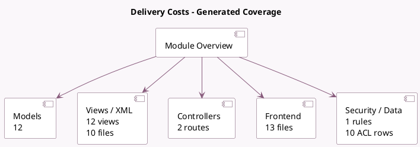

<!-- GENERATED:MODULE -->
---
tags: [odoo, community, module]
---

# Delivery Costs

- Scope: Community Addons
- Source: odoo/addons/delivery
- Dependencies: [[docs/Community Addons/sale/sale|sale]], [[docs/Community Addons/payment_custom/payment_custom|payment_custom]]

## Generated coverage

- Models: 12
- XML files with UI/data artifacts: 10
- Views: 12
- Actions: 2
- Menus: 1
- Rules (ir.rule): 1
- Access CSV entries: 10
- Controller units: 1
- Frontend asset files: 13

## Module map

## Detail notes

- Models: [[docs/Community Addons/delivery/Models|Models]] (12)
- Views and XML: [[docs/Community Addons/delivery/Views|Views]] (10 files)
- Controllers: [[docs/Community Addons/delivery/Controllers|Controllers]] (1)
- Frontend: [[docs/Community Addons/delivery/Frontend|Frontend]] (13 files)

## Key models

- `choose.delivery.carrier`
- `delivery.carrier`
- `delivery.price.rule`
- `delivery.zip.prefix`
- `ir.http`
- `ir.module.module`
- `payment.provider`
- `payment.transaction`
- `product.category`
- `res.partner`
- `sale.order`
- `sale.order.line`

## Navigation

- [[../Community Addons/Community Addons|Back to scope]]
- [[../../docs/docs|Back to docs]]

<!-- GENERATED:MODULE -->

