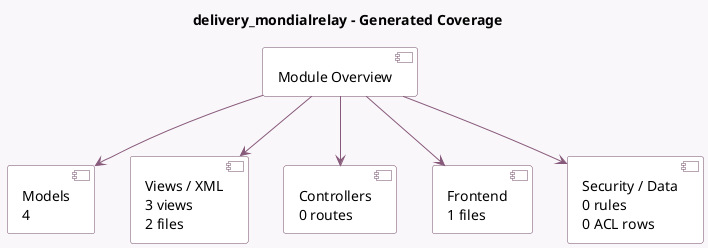

<!-- GENERATED:MODULE -->
---
tags: [odoo, community, module]
---

# delivery_mondialrelay

- Scope: Community Addons
- Source: odoo/addons/delivery_mondialrelay
- Dependencies: [[docs/Community Addons/stock_delivery/stock_delivery|stock_delivery]]

## Summary

 Let's choose a Point Relais® as shipping address 

## Generated coverage

- Models: 4
- XML files with UI/data artifacts: 2
- Views: 3
- Actions: 0
- Menus: 0
- Rules (ir.rule): 0
- Access CSV entries: 0
- Controller units: 0
- Frontend asset files: 1

## Module map

## Detail notes

- Models: [[docs/Community Addons/delivery_mondialrelay/Models|Models]] (4)
- Views and XML: [[docs/Community Addons/delivery_mondialrelay/Views|Views]] (2 files)
- Frontend: [[docs/Community Addons/delivery_mondialrelay/Frontend|Frontend]] (1 files)

## Key models

- `choose.delivery.carrier`
- `delivery.carrier`
- `res.partner`
- `sale.order`

## Navigation

- [[../Community Addons/Community Addons|Back to scope]]
- [[../../docs/docs|Back to docs]]

<!-- GENERATED:MODULE -->

