<!-- GENERATED:MODEL -->
---
tags: [odoo, community, generated, model]
---

# digest.digest

- Module: [[docs/Community Addons/digest/digest|digest]]
- Scope: Community Addons
- Defined in module: yes
- Source files: `models/digest.py`
- Python classes: `DigestDigest`
- Description: Digest

## Field footprint

- Detected fields: 13
- Field types: `Boolean` x 3, `Char` x 2, `Date` x 1, `Integer` x 2, `Many2many` x 1, `Many2one` x 2, `Selection` x 2
- Relation fields: 3

## Sample fields

- `available_fields`: `Char` (compute `_compute_available_fields`)
- `company_id`: `Many2one` (comodel `res.company`)
- `currency_id`: `Many2one` (related `company_id.currency_id`)
- `is_subscribed`: `Boolean` (comodel `Is user subscribed`, compute `_compute_is_subscribed`)
- `kpi_mail_message_total`: `Boolean` (comodel `Messages Sent`)
- `kpi_mail_message_total_value`: `Integer` (compute `_compute_kpi_mail_message_total_value`)
- `kpi_res_users_connected`: `Boolean` (comodel `Connected Users`)
- `kpi_res_users_connected_value`: `Integer` (compute `_compute_kpi_res_users_connected_value`)
- `name`: `Char`
- `next_run_date`: `Date`
- `periodicity`: `Selection`
- `state`: `Selection`
- `user_ids`: `Many2many` (comodel `res.users`)

## Method hints

- Detected methods: 32
- Action methods: `action_activate`, `action_deactivate`, `action_send`, `action_send_manual`, `action_set_periodicity`, `action_subscribe`, `action_unsubscribe`
- Compute methods: `_compute_available_fields`, `_compute_is_subscribed`, `_compute_kpi_mail_message_total_value`, `_compute_kpi_res_users_connected_value`, `_compute_kpis`, `_compute_kpis_actions`, `_compute_preferences`, `_compute_timeframes`, and 1 more
- Onchange methods: `_onchange_periodicity`

## Direct relation diagram

```plantuml
@startuml
!define ODOO_COLOR_PRIMARY #714B67
!define ODOO_COLOR_ACCENT #875A7B
!define ODOO_COLOR_BG #FAF7FA

skinparam backgroundColor ODOO_COLOR_BG
skinparam defaultTextAlignment left
skinparam ArrowColor ODOO_COLOR_ACCENT
skinparam ClassBackgroundColor white
skinparam ClassBorderColor ODOO_COLOR_PRIMARY
skinparam ComponentBackgroundColor white
skinparam ComponentBorderColor ODOO_COLOR_PRIMARY
skinparam NoteBackgroundColor #FFF8FF
skinparam NoteBorderColor ODOO_COLOR_ACCENT
skinparam SequenceLifeLineBorderColor ODOO_COLOR_ACCENT
skinparam SequenceLifeLineBackgroundColor #FFFFFF
skinparam SequenceParticipantBorderColor ODOO_COLOR_PRIMARY
skinparam SequenceParticipantBackgroundColor #FFFFFF
skinparam sequence {
  ArrowColor ODOO_COLOR_ACCENT
  ActorBorderColor ODOO_COLOR_PRIMARY
}
title digest.digest - Direct Relations
class "digest.digest" as digest_digest
class "res.company" as res_company
class "res.users" as res_users
digest_digest .. res_users : user_ids
digest_digest --> res_company : company_id
@enduml
```

## Navigation

- **Parent:** [[docs/Community Addons/digest/Models]]

<!-- GENERATED:MODEL -->
