<!-- GENERATED:MODEL -->
---
tags: [odoo, community, generated, model]
---

# digest.tip

- Module: [[docs/Community Addons/digest/digest|digest]]
- Scope: Community Addons
- Defined in module: yes
- Source files: `models/digest_tip.py`
- Python classes: `DigestTip`
- Description: Digest Tips

## Field footprint

- Detected fields: 5
- Field types: `Char` x 1, `Html` x 1, `Integer` x 1, `Many2many` x 1, `Many2one` x 1
- Relation fields: 2

## Sample fields

- `group_id`: `Many2one` (comodel `res.groups`)
- `name`: `Char` (comodel `Name`)
- `sequence`: `Integer` (comodel `Sequence`)
- `tip_description`: `Html` (comodel `Tip description`)
- `user_ids`: `Many2many` (comodel `res.users`)

## Method hints

- Detected methods: 0
- Action methods: none
- Compute methods: none
- Onchange methods: none

## Direct relation diagram

```plantuml
@startuml
!define ODOO_COLOR_PRIMARY #714B67
!define ODOO_COLOR_ACCENT #875A7B
!define ODOO_COLOR_BG #FAF7FA

skinparam backgroundColor ODOO_COLOR_BG
skinparam defaultTextAlignment left
skinparam ArrowColor ODOO_COLOR_ACCENT
skinparam ClassBackgroundColor white
skinparam ClassBorderColor ODOO_COLOR_PRIMARY
skinparam ComponentBackgroundColor white
skinparam ComponentBorderColor ODOO_COLOR_PRIMARY
skinparam NoteBackgroundColor #FFF8FF
skinparam NoteBorderColor ODOO_COLOR_ACCENT
skinparam SequenceLifeLineBorderColor ODOO_COLOR_ACCENT
skinparam SequenceLifeLineBackgroundColor #FFFFFF
skinparam SequenceParticipantBorderColor ODOO_COLOR_PRIMARY
skinparam SequenceParticipantBackgroundColor #FFFFFF
skinparam sequence {
  ArrowColor ODOO_COLOR_ACCENT
  ActorBorderColor ODOO_COLOR_PRIMARY
}
title digest.tip - Direct Relations
class "digest.tip" as digest_tip
class "res.groups" as res_groups
class "res.users" as res_users
digest_tip .. res_users : user_ids
digest_tip --> res_groups : group_id
@enduml
```

## Navigation

- **Parent:** [[docs/Community Addons/digest/Models]]

<!-- GENERATED:MODEL -->
