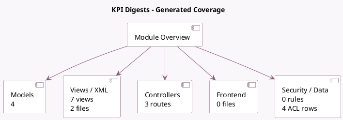

<!-- GENERATED:MODULE -->
---
tags: [odoo, community, module]
---

# KPI Digests

- Scope: Community Addons
- Source: odoo/addons/digest
- Dependencies: [[docs/Community Addons/mail/mail|mail]], [[docs/Community Addons/portal/portal|portal]], [[docs/Community Addons/resource/resource|resource]]

## Generated coverage

- Models: 4
- XML files with UI/data artifacts: 2
- Views: 7
- Actions: 2
- Menus: 2
- Rules (ir.rule): 0
- Access CSV entries: 4
- Controller units: 1
- Frontend asset files: 0

## Module map

## Detail notes

- Models: [[docs/Community Addons/digest/Models|Models]] (4)
- Views and XML: [[docs/Community Addons/digest/Views|Views]] (2 files)
- Controllers: [[docs/Community Addons/digest/Controllers|Controllers]] (1)

## Key models

- `digest.digest`
- `digest.tip`
- `res.config.settings`
- `res.users`

## Navigation

- [[../Community Addons/Community Addons|Back to scope]]
- [[../../docs/docs|Back to docs]]

<!-- GENERATED:MODULE -->

