<!-- GENERATED:MODEL -->
---
tags: [odoo, community, generated, model]
---

# event.event

- Module: [[docs/Community Addons/event/event|event]]
- Scope: Community Addons
- Defined in module: yes
- Source files: `models/event_event.py`
- Python classes: `EventEvent`
- Description: Event
- Inherits: `mail.activity.mixin`, `mail.thread`

## Field footprint

- Detected fields: 48
- Field types: `Boolean` x 10, `Char` x 4, `Datetime` x 3, `Html` x 3, `Image` x 1, `Integer` x 6, `Many2many` x 4, `Many2one` x 8, `One2many` x 4, `PropertiesDefinition` x 1, `Selection` x 4
- Relation fields: 16

## Sample fields

- `active`: `Boolean`
- `address_id`: `Many2one` (comodel `res.partner`)
- `address_inline`: `Char` (compute `_compute_address_inline`)
- `address_search`: `Many2one` (comodel `res.partner`, compute `_compute_address_search`)
- `badge_format`: `Selection`
- `badge_image`: `Image` (comodel `Badge Background`)
- `company_id`: `Many2one` (comodel `res.company`)
- `country_id`: `Many2one` (comodel `res.country`, related `address_id.country_id`, store `True`)
- `date_begin`: `Datetime`
- `date_end`: `Datetime`
- `date_tz`: `Selection` (compute `_compute_date_tz`, store `True`)
- `description`: `Html`
- `event_mail_ids`: `One2many` (comodel `event.mail`, compute `_compute_event_mail_ids`, store `True`)
- `event_registrations_open`: `Boolean` (comodel `Registration open`, compute `_compute_event_registrations_open`)
- `event_registrations_sold_out`: `Boolean` (comodel `Sold Out`, compute `_compute_event_registrations_sold_out`)
- `event_registrations_started`: `Boolean` (comodel `Registrations started`, compute `_compute_event_registrations_started`)
- `event_share_url`: `Char` (compute `_compute_event_share_url`)
- `event_slot_count`: `Integer` (comodel `Slots Count`, compute `_compute_event_slot_count`)
- `event_slot_ids`: `One2many` (comodel `event.slot`)
- `event_ticket_ids`: `One2many` (comodel `event.event.ticket`, compute `_compute_event_ticket_ids`, store `True`)

## Method hints

- Detected methods: 52
- Action methods: `action_open_slot_calendar`, `action_set_done`
- Compute methods: `_compute_address_inline`, `_compute_address_search`, `_compute_date_tz`, `_compute_display_name`, `_compute_event_mail_ids`, `_compute_event_registrations_open`, `_compute_event_registrations_sold_out`, `_compute_event_registrations_started`, and 17 more
- Onchange methods: `_onchange_event_url`, `_onchange_seats_max`

## Direct relation diagram

```plantuml
@startuml
!define ODOO_COLOR_PRIMARY #714B67
!define ODOO_COLOR_ACCENT #875A7B
!define ODOO_COLOR_BG #FAF7FA

skinparam backgroundColor ODOO_COLOR_BG
skinparam defaultTextAlignment left
skinparam ArrowColor ODOO_COLOR_ACCENT
skinparam ClassBackgroundColor white
skinparam ClassBorderColor ODOO_COLOR_PRIMARY
skinparam ComponentBackgroundColor white
skinparam ComponentBorderColor ODOO_COLOR_PRIMARY
skinparam NoteBackgroundColor #FFF8FF
skinparam NoteBorderColor ODOO_COLOR_ACCENT
skinparam SequenceLifeLineBorderColor ODOO_COLOR_ACCENT
skinparam SequenceLifeLineBackgroundColor #FFFFFF
skinparam SequenceParticipantBorderColor ODOO_COLOR_PRIMARY
skinparam SequenceParticipantBackgroundColor #FFFFFF
skinparam sequence {
  ArrowColor ODOO_COLOR_ACCENT
  ActorBorderColor ODOO_COLOR_PRIMARY
}
title event.event - Direct Relations
class "event.event" as event_event
class "event.event.ticket" as event_event_ticket
class "event.mail" as event_mail
class "event.question" as event_question
class "event.registration" as event_registration
class "event.slot" as event_slot
class "event.stage" as event_stage
class "event.tag" as event_tag
class "event.type" as event_type
class "res.company" as res_company
class "res.country" as res_country
class "res.partner" as res_partner
class "res.users" as res_users
event_event --> res_users : user_id
event_event --> res_company : company_id
event_event --> res_partner : organizer_id
event_event --> event_type : event_type_id
event_event --|> event_mail : event_mail_ids
event_event .. event_tag : tag_ids
event_event --> event_stage : stage_id
event_event --|> event_registration : registration_ids
event_event --|> event_slot : event_slot_ids
event_event --|> event_event_ticket : event_ticket_ids
event_event --> res_partner : address_id
event_event --> res_partner : address_search
event_event --> res_country : country_id
event_event .. event_question : question_ids
event_event .. event_question : general_question_ids
event_event .. event_question : specific_question_ids
@enduml
```

## Navigation

- **Parent:** [[docs/Community Addons/event/Models]]

<!-- GENERATED:MODEL -->
