<!-- GENERATED:MODEL -->
---
tags: [odoo, community, generated, model]
---

# event.event.ticket

- Module: [[docs/Community Addons/event/event|event]]
- Scope: Community Addons
- Defined in module: yes
- Source files: `models/event_ticket.py`
- Python classes: `EventEventTicket`
- Description: Event Ticket
- Inherits: `event.type.ticket`

## Field footprint

- Detected fields: 16
- Field types: `Boolean` x 4, `Char` x 1, `Datetime` x 2, `Integer` x 5, `Many2one` x 3, `One2many` x 1
- Relation fields: 4

## Sample fields

- `color`: `Char` (comodel `Color`)
- `company_id`: `Many2one` (comodel `res.company`, related `event_id.company_id`)
- `end_sale_datetime`: `Datetime`
- `event_id`: `Many2one` (comodel `event.event`)
- `event_type_id`: `Many2one`
- `is_expired`: `Boolean` (compute `_compute_is_expired`)
- `is_launched`: `Boolean` (compute `_compute_is_launched`)
- `is_sold_out`: `Boolean` (comodel `Sold Out`, compute `_compute_is_sold_out`)
- `limit_max_per_order`: `Integer`
- `registration_ids`: `One2many` (comodel `event.registration`)
- `sale_available`: `Boolean` (compute `_compute_sale_available`)
- `seats_available`: `Integer` (compute `_compute_seats`, store `False`)
- `seats_reserved`: `Integer` (compute `_compute_seats`, store `False`)
- `seats_taken`: `Integer` (compute `_compute_seats`, store `False`)
- `seats_used`: `Integer` (compute `_compute_seats`, store `False`)
- `start_sale_datetime`: `Datetime`

## Method hints

- Detected methods: 13
- Action methods: none
- Compute methods: `_compute_display_name`, `_compute_is_expired`, `_compute_is_launched`, `_compute_is_sold_out`, `_compute_sale_available`, `_compute_seats`
- Onchange methods: none

## Direct relation diagram

```plantuml
@startuml
!define ODOO_COLOR_PRIMARY #714B67
!define ODOO_COLOR_ACCENT #875A7B
!define ODOO_COLOR_BG #FAF7FA

skinparam backgroundColor ODOO_COLOR_BG
skinparam defaultTextAlignment left
skinparam ArrowColor ODOO_COLOR_ACCENT
skinparam ClassBackgroundColor white
skinparam ClassBorderColor ODOO_COLOR_PRIMARY
skinparam ComponentBackgroundColor white
skinparam ComponentBorderColor ODOO_COLOR_PRIMARY
skinparam NoteBackgroundColor #FFF8FF
skinparam NoteBorderColor ODOO_COLOR_ACCENT
skinparam SequenceLifeLineBorderColor ODOO_COLOR_ACCENT
skinparam SequenceLifeLineBackgroundColor #FFFFFF
skinparam SequenceParticipantBorderColor ODOO_COLOR_PRIMARY
skinparam SequenceParticipantBackgroundColor #FFFFFF
skinparam sequence {
  ArrowColor ODOO_COLOR_ACCENT
  ActorBorderColor ODOO_COLOR_PRIMARY
}
title event.event.ticket - Direct Relations
class "event.event.ticket" as event_event_ticket
class "event.event" as event_event
class "event.registration" as event_registration
class "res.company" as res_company
event_event_ticket --> event_event : event_id
event_event_ticket --> res_company : company_id
event_event_ticket --|> event_registration : registration_ids
@enduml
```

## Navigation

- **Parent:** [[docs/Community Addons/event/Models]]

<!-- GENERATED:MODEL -->
