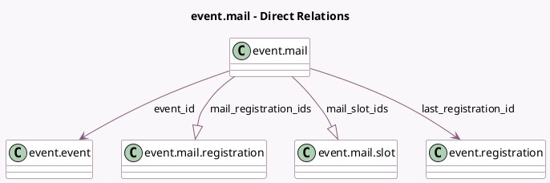

<!-- GENERATED:MODEL -->
---
tags: [odoo, community, generated, model]
---

# event.mail

- Module: [[docs/Community Addons/event/event|event]]
- Scope: Community Addons
- Defined in module: yes
- Source files: `models/event_mail.py`
- Python classes: `EventMail`
- Description: Event Automated Mailing

## Field footprint

- Detected fields: 15
- Field types: `Boolean` x 1, `Datetime` x 2, `Integer` x 3, `Many2one` x 2, `One2many` x 2, `Reference` x 1, `Selection` x 4
- Relation fields: 4

## Sample fields

- `error_datetime`: `Datetime` (comodel `Last Error`)
- `event_id`: `Many2one` (comodel `event.event`)
- `interval_nbr`: `Integer` (comodel `Interval`)
- `interval_type`: `Selection`
- `interval_unit`: `Selection`
- `last_registration_id`: `Many2one` (comodel `event.registration`)
- `mail_count_done`: `Integer` (comodel `# Sent`)
- `mail_done`: `Boolean` (comodel `Sent`)
- `mail_registration_ids`: `One2many` (comodel `event.mail.registration`)
- `mail_slot_ids`: `One2many` (comodel `event.mail.slot`)
- `mail_state`: `Selection` (compute `_compute_mail_state`)
- `notification_type`: `Selection` (compute `_compute_notification_type`)
- `scheduled_date`: `Datetime` (comodel `Schedule Date`, compute `_compute_scheduled_date`, store `True`)
- `sequence`: `Integer` (comodel `Display order`)
- `template_ref`: `Reference`

## Method hints

- Detected methods: 17
- Action methods: none
- Compute methods: `_compute_mail_state`, `_compute_notification_type`, `_compute_scheduled_date`
- Onchange methods: none

## Direct relation diagram

## Navigation

- **Parent:** [[docs/Community Addons/event/Models]]

<!-- GENERATED:MODEL -->
