<!-- GENERATED:MODEL -->
---
tags: [odoo, community, generated, model]
---

# event.mail.slot

- Module: [[docs/Community Addons/event/event|event]]
- Scope: Community Addons
- Defined in module: yes
- Source files: `models/event_mail_slot.py`
- Python classes: `EventMailRegistration`
- Description: Slot Mail Scheduler

## Field footprint

- Detected fields: 6
- Field types: `Boolean` x 1, `Datetime` x 1, `Integer` x 1, `Many2one` x 3
- Relation fields: 3

## Sample fields

- `event_slot_id`: `Many2one` (comodel `event.slot`)
- `last_registration_id`: `Many2one` (comodel `event.registration`)
- `mail_count_done`: `Integer` (comodel `# Sent`)
- `mail_done`: `Boolean` (comodel `Sent`)
- `scheduled_date`: `Datetime` (comodel `Schedule Date`, compute `_compute_scheduled_date`, store `True`)
- `scheduler_id`: `Many2one` (comodel `event.mail`)

## Method hints

- Detected methods: 1
- Action methods: none
- Compute methods: `_compute_scheduled_date`
- Onchange methods: none

## Direct relation diagram

```plantuml
@startuml
!define ODOO_COLOR_PRIMARY #714B67
!define ODOO_COLOR_ACCENT #875A7B
!define ODOO_COLOR_BG #FAF7FA

skinparam backgroundColor ODOO_COLOR_BG
skinparam defaultTextAlignment left
skinparam ArrowColor ODOO_COLOR_ACCENT
skinparam ClassBackgroundColor white
skinparam ClassBorderColor ODOO_COLOR_PRIMARY
skinparam ComponentBackgroundColor white
skinparam ComponentBorderColor ODOO_COLOR_PRIMARY
skinparam NoteBackgroundColor #FFF8FF
skinparam NoteBorderColor ODOO_COLOR_ACCENT
skinparam SequenceLifeLineBorderColor ODOO_COLOR_ACCENT
skinparam SequenceLifeLineBackgroundColor #FFFFFF
skinparam SequenceParticipantBorderColor ODOO_COLOR_PRIMARY
skinparam SequenceParticipantBackgroundColor #FFFFFF
skinparam sequence {
  ArrowColor ODOO_COLOR_ACCENT
  ActorBorderColor ODOO_COLOR_PRIMARY
}
title event.mail.slot - Direct Relations
class "event.mail.slot" as event_mail_slot
class "event.mail" as event_mail
class "event.registration" as event_registration
class "event.slot" as event_slot
event_mail_slot --> event_slot : event_slot_id
event_mail_slot --> event_mail : scheduler_id
event_mail_slot --> event_registration : last_registration_id
@enduml
```

## Navigation

- **Parent:** [[docs/Community Addons/event/Models]]

<!-- GENERATED:MODEL -->
