<!-- GENERATED:MODEL -->
---
tags: [odoo, community, generated, model]
---

# event.question

- Module: [[docs/Community Addons/event/event|event]]
- Scope: Community Addons
- Defined in module: yes
- Source files: `models/event_question.py`
- Python classes: `EventQuestion`
- Description: Event Question

## Field footprint

- Detected fields: 12
- Field types: `Boolean` x 5, `Char` x 1, `Integer` x 2, `Many2many` x 2, `One2many` x 1, `Selection` x 1
- Relation fields: 3

## Sample fields

- `active`: `Boolean` (comodel `Active`)
- `answer_ids`: `One2many` (comodel `event.question.answer`)
- `event_count`: `Integer` (comodel `# Events`, compute `_compute_event_count`)
- `event_ids`: `Many2many` (comodel `event.event`)
- `event_type_ids`: `Many2many` (comodel `event.type`)
- `is_default`: `Boolean` (comodel `Default question`)
- `is_mandatory_answer`: `Boolean` (comodel `Mandatory Answer`)
- `is_reusable`: `Boolean` (comodel `Is Reusable`, compute `_compute_is_reusable`, store `True`)
- `once_per_order`: `Boolean` (comodel `Ask once per order`)
- `question_type`: `Selection`
- `sequence`: `Integer`
- `title`: `Char`

## Method hints

- Detected methods: 7
- Action methods: `action_event_view`, `action_view_question_answers`
- Compute methods: `_compute_event_count`, `_compute_is_reusable`
- Onchange methods: none

## Direct relation diagram

```plantuml
@startuml
!define ODOO_COLOR_PRIMARY #714B67
!define ODOO_COLOR_ACCENT #875A7B
!define ODOO_COLOR_BG #FAF7FA

skinparam backgroundColor ODOO_COLOR_BG
skinparam defaultTextAlignment left
skinparam ArrowColor ODOO_COLOR_ACCENT
skinparam ClassBackgroundColor white
skinparam ClassBorderColor ODOO_COLOR_PRIMARY
skinparam ComponentBackgroundColor white
skinparam ComponentBorderColor ODOO_COLOR_PRIMARY
skinparam NoteBackgroundColor #FFF8FF
skinparam NoteBorderColor ODOO_COLOR_ACCENT
skinparam SequenceLifeLineBorderColor ODOO_COLOR_ACCENT
skinparam SequenceLifeLineBackgroundColor #FFFFFF
skinparam SequenceParticipantBorderColor ODOO_COLOR_PRIMARY
skinparam SequenceParticipantBackgroundColor #FFFFFF
skinparam sequence {
  ArrowColor ODOO_COLOR_ACCENT
  ActorBorderColor ODOO_COLOR_PRIMARY
}
title event.question - Direct Relations
class "event.question" as event_question
class "event.event" as event_event
class "event.question.answer" as event_question_answer
class "event.type" as event_type
event_question .. event_type : event_type_ids
event_question .. event_event : event_ids
event_question --|> event_question_answer : answer_ids
@enduml
```

## Navigation

- **Parent:** [[docs/Community Addons/event/Models]]

<!-- GENERATED:MODEL -->
