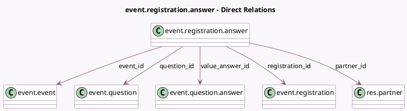

<!-- GENERATED:MODEL -->
---
tags: [odoo, community, generated, model]
---

# event.registration.answer

- Module: [[docs/Community Addons/event/event|event]]
- Scope: Community Addons
- Defined in module: yes
- Source files: `models/event_registration_answer.py`
- Python classes: `EventRegistrationAnswer`
- Description: Event Registration Answer

## Field footprint

- Detected fields: 7
- Field types: `Many2one` x 5, `Selection` x 1, `Text` x 1
- Relation fields: 5

## Sample fields

- `event_id`: `Many2one` (comodel `event.event`, related `registration_id.event_id`)
- `partner_id`: `Many2one` (comodel `res.partner`, related `registration_id.partner_id`)
- `question_id`: `Many2one` (comodel `event.question`)
- `question_type`: `Selection` (related `question_id.question_type`)
- `registration_id`: `Many2one` (comodel `event.registration`)
- `value_answer_id`: `Many2one` (comodel `event.question.answer`)
- `value_text_box`: `Text` (comodel `Text answer`)

## Method hints

- Detected methods: 1
- Action methods: none
- Compute methods: `_compute_display_name`
- Onchange methods: none

## Direct relation diagram

## Navigation

- **Parent:** [[docs/Community Addons/event/Models]]

<!-- GENERATED:MODEL -->
