<!-- GENERATED:MODEL -->
---
tags: [odoo, community, generated, model]
---

# event.registration

- Module: [[docs/Community Addons/event/event|event]]
- Scope: Community Addons
- Defined in module: yes
- Source files: `models/event_registration.py`
- Python classes: `EventRegistration`
- Description: Event Registration
- Inherits: `mail.activity.mixin`, `mail.thread`

## Field footprint

- Detected fields: 26
- Field types: `Boolean` x 2, `Char` x 6, `Datetime` x 3, `Many2one` x 10, `One2many` x 3, `Properties` x 1, `Selection` x 1
- Relation fields: 13

## Sample fields

- `active`: `Boolean`
- `barcode`: `Char`
- `company_id`: `Many2one` (comodel `res.company`, related `event_id.company_id`, store `True`)
- `company_name`: `Char` (compute `_compute_company_name`, store `True`)
- `date_closed`: `Datetime` (compute `_compute_date_closed`, store `True`)
- `email`: `Char` (compute `_compute_email`, store `True`)
- `event_begin_date`: `Datetime` (comodel `Event Start Date`, compute `_compute_event_begin_date`)
- `event_date_range`: `Char` (comodel `Date Range`, compute `_compute_date_range`)
- `event_end_date`: `Datetime` (comodel `Event End Date`, compute `_compute_event_end_date`)
- `event_id`: `Many2one` (comodel `event.event`)
- `event_organizer_id`: `Many2one` (related `event_id.organizer_id`)
- `event_slot_id`: `Many2one` (comodel `event.slot`)
- `event_ticket_id`: `Many2one` (comodel `event.event.ticket`)
- `event_user_id`: `Many2one` (related `event_id.user_id`)
- `is_multi_slots`: `Boolean` (related `event_id.is_multi_slots`)
- `mail_registration_ids`: `One2many` (comodel `event.mail.registration`)
- `name`: `Char` (compute `_compute_name`, store `True`)
- `partner_id`: `Many2one` (comodel `res.partner`)
- `phone`: `Char` (compute `_compute_phone`, store `True`)
- `registration_answer_choice_ids`: `One2many` (comodel `event.registration.answer`)

## Method hints

- Detected methods: 33
- Action methods: `action_cancel`, `action_confirm`, `action_send_badge_email`, `action_set_done`, `action_set_draft`
- Compute methods: `_compute_company_name`, `_compute_date_closed`, `_compute_date_range`, `_compute_display_name`, `_compute_email`, `_compute_event_begin_date`, `_compute_event_end_date`, `_compute_name`, and 1 more
- Onchange methods: `_onchange_event`, `_onchange_phone_validation`

## Direct relation diagram

```plantuml
@startuml
!define ODOO_COLOR_PRIMARY #714B67
!define ODOO_COLOR_ACCENT #875A7B
!define ODOO_COLOR_BG #FAF7FA

skinparam backgroundColor ODOO_COLOR_BG
skinparam defaultTextAlignment left
skinparam ArrowColor ODOO_COLOR_ACCENT
skinparam ClassBackgroundColor white
skinparam ClassBorderColor ODOO_COLOR_PRIMARY
skinparam ComponentBackgroundColor white
skinparam ComponentBorderColor ODOO_COLOR_PRIMARY
skinparam NoteBackgroundColor #FFF8FF
skinparam NoteBorderColor ODOO_COLOR_ACCENT
skinparam SequenceLifeLineBorderColor ODOO_COLOR_ACCENT
skinparam SequenceLifeLineBackgroundColor #FFFFFF
skinparam SequenceParticipantBorderColor ODOO_COLOR_PRIMARY
skinparam SequenceParticipantBackgroundColor #FFFFFF
skinparam sequence {
  ArrowColor ODOO_COLOR_ACCENT
  ActorBorderColor ODOO_COLOR_PRIMARY
}
title event.registration - Direct Relations
class "event.registration" as event_registration
class "event.event" as event_event
class "event.event.ticket" as event_event_ticket
class "event.mail.registration" as event_mail_registration
class "event.registration.answer" as event_registration_answer
class "event.slot" as event_slot
class "res.company" as res_company
class "res.partner" as res_partner
class "utm.campaign" as utm_campaign
class "utm.medium" as utm_medium
class "utm.source" as utm_source
event_registration --> event_event : event_id
event_registration --> event_slot : event_slot_id
event_registration --> event_event_ticket : event_ticket_id
event_registration --> utm_campaign : utm_campaign_id
event_registration --> utm_source : utm_source_id
event_registration --> utm_medium : utm_medium_id
event_registration --> res_partner : partner_id
event_registration --> res_company : company_id
event_registration --|> event_registration_answer : registration_answer_ids
event_registration --|> event_registration_answer : registration_answer_choice_ids
event_registration --|> event_mail_registration : mail_registration_ids
@enduml
```

## Navigation

- **Parent:** [[docs/Community Addons/event/Models]]

<!-- GENERATED:MODEL -->
