<!-- GENERATED:MODEL -->
---
tags: [odoo, community, generated, model]
---

# event.slot

- Module: [[docs/Community Addons/event/event|event]]
- Scope: Community Addons
- Defined in module: yes
- Source files: `models/event_slot.py`
- Python classes: `EventSlot`
- Description: Event Slot

## Field footprint

- Detected fields: 14
- Field types: `Boolean` x 1, `Date` x 1, `Datetime` x 2, `Float` x 2, `Integer` x 5, `Many2one` x 1, `One2many` x 1, `Selection` x 1
- Relation fields: 2

## Sample fields

- `color`: `Integer` (comodel `Color`)
- `date`: `Date` (comodel `Date`)
- `date_tz`: `Selection` (related `event_id.date_tz`)
- `end_datetime`: `Datetime` (comodel `End Datetime`, compute `_compute_datetimes`, store `True`)
- `end_hour`: `Float` (comodel `Ending Hour`)
- `event_id`: `Many2one` (comodel `event.event`)
- `is_sold_out`: `Boolean` (comodel `Sold Out`, compute `_compute_is_sold_out`)
- `registration_ids`: `One2many` (comodel `event.registration`)
- `seats_available`: `Integer` (compute `_compute_seats`, store `False`)
- `seats_reserved`: `Integer` (compute `_compute_seats`, store `False`)
- `seats_taken`: `Integer` (compute `_compute_seats`, store `False`)
- `seats_used`: `Integer` (compute `_compute_seats`, store `False`)
- `start_datetime`: `Datetime` (comodel `Start Datetime`, compute `_compute_datetimes`, store `True`)
- `start_hour`: `Float` (comodel `Starting Hour`)

## Method hints

- Detected methods: 7
- Action methods: none
- Compute methods: `_compute_datetimes`, `_compute_display_name`, `_compute_is_sold_out`, `_compute_seats`
- Onchange methods: none

## Direct relation diagram

```plantuml
@startuml
!define ODOO_COLOR_PRIMARY #714B67
!define ODOO_COLOR_ACCENT #875A7B
!define ODOO_COLOR_BG #FAF7FA

skinparam backgroundColor ODOO_COLOR_BG
skinparam defaultTextAlignment left
skinparam ArrowColor ODOO_COLOR_ACCENT
skinparam ClassBackgroundColor white
skinparam ClassBorderColor ODOO_COLOR_PRIMARY
skinparam ComponentBackgroundColor white
skinparam ComponentBorderColor ODOO_COLOR_PRIMARY
skinparam NoteBackgroundColor #FFF8FF
skinparam NoteBorderColor ODOO_COLOR_ACCENT
skinparam SequenceLifeLineBorderColor ODOO_COLOR_ACCENT
skinparam SequenceLifeLineBackgroundColor #FFFFFF
skinparam SequenceParticipantBorderColor ODOO_COLOR_PRIMARY
skinparam SequenceParticipantBackgroundColor #FFFFFF
skinparam sequence {
  ArrowColor ODOO_COLOR_ACCENT
  ActorBorderColor ODOO_COLOR_PRIMARY
}
title event.slot - Direct Relations
class "event.slot" as event_slot
class "event.event" as event_event
class "event.registration" as event_registration
event_slot --> event_event : event_id
event_slot --|> event_registration : registration_ids
@enduml
```

## Navigation

- **Parent:** [[docs/Community Addons/event/Models]]

<!-- GENERATED:MODEL -->
