<!-- GENERATED:MODEL -->
---
tags: [odoo, community, generated, model]
---

# event.type.mail

- Module: [[docs/Community Addons/event/event|event]]
- Scope: Community Addons
- Defined in module: yes
- Source files: `models/event_type_mail.py`
- Python classes: `EventTypeMail`
- Description: Mail Scheduling on Event Category

## Field footprint

- Detected fields: 6
- Field types: `Integer` x 1, `Many2one` x 1, `Reference` x 1, `Selection` x 3
- Relation fields: 1

## Sample fields

- `event_type_id`: `Many2one` (comodel `event.type`)
- `interval_nbr`: `Integer` (comodel `Interval`)
- `interval_type`: `Selection`
- `interval_unit`: `Selection`
- `notification_type`: `Selection` (compute `_compute_notification_type`)
- `template_ref`: `Reference`

## Method hints

- Detected methods: 2
- Action methods: none
- Compute methods: `_compute_notification_type`
- Onchange methods: none

## Direct relation diagram

```plantuml
@startuml
!define ODOO_COLOR_PRIMARY #714B67
!define ODOO_COLOR_ACCENT #875A7B
!define ODOO_COLOR_BG #FAF7FA

skinparam backgroundColor ODOO_COLOR_BG
skinparam defaultTextAlignment left
skinparam ArrowColor ODOO_COLOR_ACCENT
skinparam ClassBackgroundColor white
skinparam ClassBorderColor ODOO_COLOR_PRIMARY
skinparam ComponentBackgroundColor white
skinparam ComponentBorderColor ODOO_COLOR_PRIMARY
skinparam NoteBackgroundColor #FFF8FF
skinparam NoteBorderColor ODOO_COLOR_ACCENT
skinparam SequenceLifeLineBorderColor ODOO_COLOR_ACCENT
skinparam SequenceLifeLineBackgroundColor #FFFFFF
skinparam SequenceParticipantBorderColor ODOO_COLOR_PRIMARY
skinparam SequenceParticipantBackgroundColor #FFFFFF
skinparam sequence {
  ArrowColor ODOO_COLOR_ACCENT
  ActorBorderColor ODOO_COLOR_PRIMARY
}
title event.type.mail - Direct Relations
class "event.type.mail" as event_type_mail
class "event.type" as event_type
event_type_mail --> event_type : event_type_id
@enduml
```

## Navigation

- **Parent:** [[docs/Community Addons/event/Models]]

<!-- GENERATED:MODEL -->
