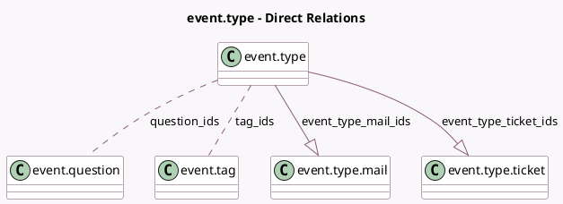

<!-- GENERATED:MODEL -->
---
tags: [odoo, community, generated, model]
---

# event.type

- Module: [[docs/Community Addons/event/event|event]]
- Scope: Community Addons
- Defined in module: yes
- Source files: `models/event_type.py`
- Python classes: `EventType`
- Description: Event Template

## Field footprint

- Detected fields: 11
- Field types: `Boolean` x 1, `Char` x 1, `Html` x 2, `Integer` x 2, `Many2many` x 2, `One2many` x 2, `Selection` x 1
- Relation fields: 4

## Sample fields

- `default_timezone`: `Selection`
- `event_type_mail_ids`: `One2many` (comodel `event.type.mail`)
- `event_type_ticket_ids`: `One2many` (comodel `event.type.ticket`)
- `has_seats_limitation`: `Boolean` (comodel `Limited Seats`)
- `name`: `Char` (comodel `Event Template`)
- `note`: `Html`
- `question_ids`: `Many2many` (comodel `event.question`)
- `seats_max`: `Integer` (comodel `Maximum Registrations`, compute `_compute_seats_max`, store `True`)
- `sequence`: `Integer`
- `tag_ids`: `Many2many` (comodel `event.tag`)
- `ticket_instructions`: `Html` (comodel `Ticket Instructions`)

## Method hints

- Detected methods: 3
- Action methods: none
- Compute methods: `_compute_seats_max`
- Onchange methods: none

## Direct relation diagram

## Navigation

- **Parent:** [[docs/Community Addons/event/Models]]

<!-- GENERATED:MODEL -->
