<!-- GENERATED:MODEL -->
---
tags: [odoo, community, generated, model]
---

# res.config.settings

- Module: [[docs/Community Addons/event/event|event]]
- Scope: Community Addons
- Defined in module: extension only
- Source files: `models/res_config_settings.py`
- Python classes: `ResConfigSettings`

## Field footprint

- Detected fields: 13
- Field types: `Boolean` x 10, `Char` x 2, `Many2one` x 1
- Relation fields: 1

## Sample fields

- `barcode_nomenclature_id`: `Many2one` (comodel `barcode.nomenclature`, related `company_id.nomenclature_id`)
- `google_maps_static_api_key`: `Char` (comodel `Google Maps API key`, compute `_compute_maps_static_api_key`, store `True`)
- `google_maps_static_api_secret`: `Char` (comodel `Google Maps API secret`, compute `_compute_maps_static_api_secret`, store `True`)
- `module_event_booth`: `Boolean` (comodel `Booth Management`)
- `module_event_sale`: `Boolean` (comodel `Tickets with Sale`)
- `module_pos_event`: `Boolean` (comodel `Tickets with PoS`)
- `module_website_event_exhibitor`: `Boolean` (comodel `Advanced Sponsors`)
- `module_website_event_sale`: `Boolean` (comodel `Online Ticketing`)
- `module_website_event_track`: `Boolean` (comodel `Tracks and Agenda`)
- `module_website_event_track_live`: `Boolean` (comodel `Live Mode`)
- `module_website_event_track_quiz`: `Boolean` (comodel `Quiz on Tracks`)
- `use_event_barcode`: `Boolean`
- `use_google_maps_static_api`: `Boolean` (comodel `Google Maps static API`)

## Method hints

- Detected methods: 7
- Action methods: none
- Compute methods: `_compute_maps_static_api_key`, `_compute_maps_static_api_secret`
- Onchange methods: `_onchange_module_website_event_track`

## Direct relation diagram

```plantuml
@startuml
!define ODOO_COLOR_PRIMARY #714B67
!define ODOO_COLOR_ACCENT #875A7B
!define ODOO_COLOR_BG #FAF7FA

skinparam backgroundColor ODOO_COLOR_BG
skinparam defaultTextAlignment left
skinparam ArrowColor ODOO_COLOR_ACCENT
skinparam ClassBackgroundColor white
skinparam ClassBorderColor ODOO_COLOR_PRIMARY
skinparam ComponentBackgroundColor white
skinparam ComponentBorderColor ODOO_COLOR_PRIMARY
skinparam NoteBackgroundColor #FFF8FF
skinparam NoteBorderColor ODOO_COLOR_ACCENT
skinparam SequenceLifeLineBorderColor ODOO_COLOR_ACCENT
skinparam SequenceLifeLineBackgroundColor #FFFFFF
skinparam SequenceParticipantBorderColor ODOO_COLOR_PRIMARY
skinparam SequenceParticipantBackgroundColor #FFFFFF
skinparam sequence {
  ArrowColor ODOO_COLOR_ACCENT
  ActorBorderColor ODOO_COLOR_PRIMARY
}
title res.config.settings - Direct Relations
class "res.config.settings" as res_config_settings
class "barcode.nomenclature" as barcode_nomenclature
res_config_settings --> barcode_nomenclature : barcode_nomenclature_id
@enduml
```

## Navigation

- **Parent:** [[docs/Community Addons/event/Models]]

<!-- GENERATED:MODEL -->
