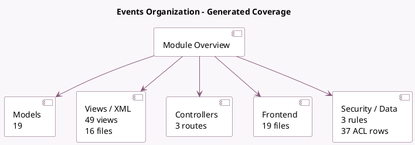

<!-- GENERATED:MODULE -->
---
tags: [odoo, community, module]
---

# Events Organization

- Scope: Community Addons
- Source: odoo/addons/event
- Dependencies: [[docs/Community Addons/barcodes/barcodes|barcodes]], [[docs/Community Addons/base_setup/base_setup|base_setup]], [[docs/Community Addons/mail/mail|mail]], [[docs/Community Addons/phone_validation/phone_validation|phone_validation]], [[docs/Community Addons/portal/portal|portal]], [[docs/Community Addons/utm/utm|utm]]

## Summary

Trainings, Conferences, Meetings, Exhibitions, Registrations

## Generated coverage

- Models: 19
- XML files with UI/data artifacts: 16
- Views: 49
- Actions: 23
- Menus: 18
- Rules (ir.rule): 3
- Access CSV entries: 37
- Controller units: 1
- Frontend asset files: 19

## Module map

## Detail notes

- Models: [[docs/Community Addons/event/Models|Models]] (19)
- Views and XML: [[docs/Community Addons/event/Views|Views]] (16 files)
- Controllers: [[docs/Community Addons/event/Controllers|Controllers]] (1)
- Frontend: [[docs/Community Addons/event/Frontend|Frontend]] (19 files)

## Key models

- `event.event`
- `event.event.ticket`
- `event.mail`
- `event.mail.registration`
- `event.mail.slot`
- `event.question`
- `event.question.answer`
- `event.registration`
- `event.registration.answer`
- `event.slot`
- `event.stage`
- `event.tag`

## Navigation

- [[../Community Addons/Community Addons|Back to scope]]
- [[../../docs/docs|Back to docs]]

<!-- GENERATED:MODULE -->

