<!-- GENERATED:MODEL -->
---
tags: [odoo, community, generated, model]
---

# event.booth

- Module: [[docs/Community Addons/event_booth/event_booth|event_booth]]
- Scope: Community Addons
- Defined in module: yes
- Source files: `models/event_booth.py`
- Python classes: `EventBooth`
- Description: Event Booth
- Inherits: `event.type.booth`, `mail.activity.mixin`, `mail.thread`

## Field footprint

- Detected fields: 8
- Field types: `Boolean` x 1, `Char` x 3, `Many2one` x 3, `Selection` x 1
- Relation fields: 3

## Sample fields

- `contact_email`: `Char` (comodel `Renter Email`, compute `_compute_contact_email`, store `True`)
- `contact_name`: `Char` (comodel `Renter Name`, compute `_compute_contact_name`, store `True`)
- `contact_phone`: `Char` (comodel `Renter Phone`, compute `_compute_contact_phone`, store `True`)
- `event_id`: `Many2one` (comodel `event.event`)
- `event_type_id`: `Many2one`
- `is_available`: `Boolean` (compute `_compute_is_available`)
- `partner_id`: `Many2one` (comodel `res.partner`)
- `state`: `Selection`

## Method hints

- Detected methods: 10
- Action methods: `action_confirm`
- Compute methods: `_compute_contact_email`, `_compute_contact_name`, `_compute_contact_phone`, `_compute_is_available`
- Onchange methods: none

## Direct relation diagram

```plantuml
@startuml
!define ODOO_COLOR_PRIMARY #714B67
!define ODOO_COLOR_ACCENT #875A7B
!define ODOO_COLOR_BG #FAF7FA

skinparam backgroundColor ODOO_COLOR_BG
skinparam defaultTextAlignment left
skinparam ArrowColor ODOO_COLOR_ACCENT
skinparam ClassBackgroundColor white
skinparam ClassBorderColor ODOO_COLOR_PRIMARY
skinparam ComponentBackgroundColor white
skinparam ComponentBorderColor ODOO_COLOR_PRIMARY
skinparam NoteBackgroundColor #FFF8FF
skinparam NoteBorderColor ODOO_COLOR_ACCENT
skinparam SequenceLifeLineBorderColor ODOO_COLOR_ACCENT
skinparam SequenceLifeLineBackgroundColor #FFFFFF
skinparam SequenceParticipantBorderColor ODOO_COLOR_PRIMARY
skinparam SequenceParticipantBackgroundColor #FFFFFF
skinparam sequence {
  ArrowColor ODOO_COLOR_ACCENT
  ActorBorderColor ODOO_COLOR_PRIMARY
}
title event.booth - Direct Relations
class "event.booth" as event_booth
class "event.event" as event_event
class "res.partner" as res_partner
event_booth --> event_event : event_id
event_booth --> res_partner : partner_id
@enduml
```

## Navigation

- **Parent:** [[docs/Community Addons/event_booth/Models]]

<!-- GENERATED:MODEL -->
