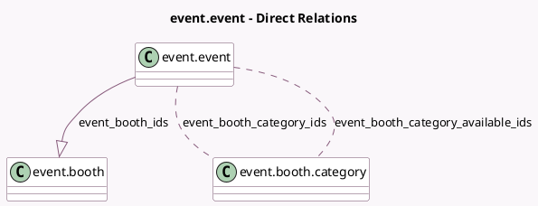

<!-- GENERATED:MODEL -->
---
tags: [odoo, community, generated, model]
---

# event.event

- Module: [[docs/Community Addons/event_booth/event_booth|event_booth]]
- Scope: Community Addons
- Defined in module: extension only
- Source files: `models/event_event.py`
- Python classes: `EventEvent`

## Field footprint

- Detected fields: 5
- Field types: `Integer` x 2, `Many2many` x 2, `One2many` x 1
- Relation fields: 3

## Sample fields

- `event_booth_category_available_ids`: `Many2many` (comodel `event.booth.category`, compute `_compute_event_booth_category_available_ids`)
- `event_booth_category_ids`: `Many2many` (comodel `event.booth.category`, compute `_compute_event_booth_category_ids`)
- `event_booth_count`: `Integer` (compute `_compute_event_booth_count`)
- `event_booth_count_available`: `Integer` (compute `_compute_event_booth_count`)
- `event_booth_ids`: `One2many` (comodel `event.booth`, compute `_compute_event_booth_ids`, store `True`)

## Method hints

- Detected methods: 5
- Action methods: none
- Compute methods: `_compute_event_booth_category_available_ids`, `_compute_event_booth_category_ids`, `_compute_event_booth_count`, `_compute_event_booth_ids`
- Onchange methods: none

## Direct relation diagram

## Navigation

- **Parent:** [[docs/Community Addons/event_booth/Models]]

<!-- GENERATED:MODEL -->
