<!-- GENERATED:MODEL -->
---
tags: [odoo, community, generated, model]
---

# event.type.booth

- Module: [[docs/Community Addons/event_booth/event_booth|event_booth]]
- Scope: Community Addons
- Defined in module: yes
- Source files: `models/event_type_booth.py`
- Python classes: `EventTypeBooth`
- Description: Event Booth Template

## Field footprint

- Detected fields: 3
- Field types: `Char` x 1, `Many2one` x 2
- Relation fields: 2

## Sample fields

- `booth_category_id`: `Many2one` (comodel `event.booth.category`)
- `event_type_id`: `Many2one` (comodel `event.type`)
- `name`: `Char`

## Method hints

- Detected methods: 2
- Action methods: none
- Compute methods: none
- Onchange methods: none

## Direct relation diagram

```plantuml
@startuml
!define ODOO_COLOR_PRIMARY #714B67
!define ODOO_COLOR_ACCENT #875A7B
!define ODOO_COLOR_BG #FAF7FA

skinparam backgroundColor ODOO_COLOR_BG
skinparam defaultTextAlignment left
skinparam ArrowColor ODOO_COLOR_ACCENT
skinparam ClassBackgroundColor white
skinparam ClassBorderColor ODOO_COLOR_PRIMARY
skinparam ComponentBackgroundColor white
skinparam ComponentBorderColor ODOO_COLOR_PRIMARY
skinparam NoteBackgroundColor #FFF8FF
skinparam NoteBorderColor ODOO_COLOR_ACCENT
skinparam SequenceLifeLineBorderColor ODOO_COLOR_ACCENT
skinparam SequenceLifeLineBackgroundColor #FFFFFF
skinparam SequenceParticipantBorderColor ODOO_COLOR_PRIMARY
skinparam SequenceParticipantBackgroundColor #FFFFFF
skinparam sequence {
  ArrowColor ODOO_COLOR_ACCENT
  ActorBorderColor ODOO_COLOR_PRIMARY
}
title event.type.booth - Direct Relations
class "event.type.booth" as event_type_booth
class "event.booth.category" as event_booth_category
class "event.type" as event_type
event_type_booth --> event_type : event_type_id
event_type_booth --> event_booth_category : booth_category_id
@enduml
```

## Navigation

- **Parent:** [[docs/Community Addons/event_booth/Models]]

<!-- GENERATED:MODEL -->
