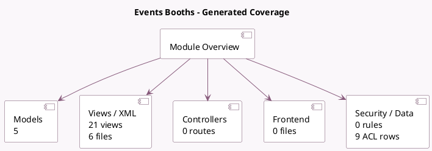

<!-- GENERATED:MODULE -->
---
tags: [odoo, community, module]
---

# Events Booths

- Scope: Community Addons
- Source: odoo/addons/event_booth
- Dependencies: [[docs/Community Addons/event/event|event]]

## Summary

Manage event booths

## Generated coverage

- Models: 5
- XML files with UI/data artifacts: 6
- Views: 21
- Actions: 7
- Menus: 2
- Rules (ir.rule): 0
- Access CSV entries: 9
- Controller units: 0
- Frontend asset files: 0

## Module map

## Detail notes

- Models: [[docs/Community Addons/event_booth/Models|Models]] (5)
- Views and XML: [[docs/Community Addons/event_booth/Views|Views]] (6 files)

## Key models

- `event.booth`
- `event.booth.category`
- `event.event`
- `event.type`
- `event.type.booth`

## Navigation

- [[../Community Addons/Community Addons|Back to scope]]
- [[../../docs/docs|Back to docs]]

<!-- GENERATED:MODULE -->

