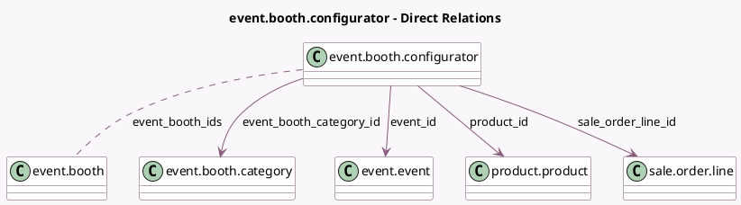

<!-- GENERATED:MODEL -->
---
tags: [odoo, community, generated, model]
---

# event.booth.configurator

- Module: [[docs/Community Addons/event_booth_sale/event_booth_sale|event_booth_sale]]
- Scope: Community Addons
- Defined in module: yes
- Source files: `wizard/event_booth_configurator.py`
- Python classes: `EventBoothConfigurator`
- Description: Event Booth Configurator

## Field footprint

- Detected fields: 6
- Field types: `Many2many` x 2, `Many2one` x 4
- Relation fields: 6

## Sample fields

- `event_booth_category_available_ids`: `Many2many` (related `event_id.event_booth_category_available_ids`)
- `event_booth_category_id`: `Many2one` (comodel `event.booth.category`, compute `_compute_event_booth_category_id`, store `True`)
- `event_booth_ids`: `Many2many` (comodel `event.booth`, compute `_compute_event_booth_ids`, store `True`)
- `event_id`: `Many2one` (comodel `event.event`)
- `product_id`: `Many2one` (comodel `product.product`)
- `sale_order_line_id`: `Many2one` (comodel `sale.order.line`)

## Method hints

- Detected methods: 3
- Action methods: none
- Compute methods: `_compute_event_booth_category_id`, `_compute_event_booth_ids`
- Onchange methods: none

## Direct relation diagram

## Navigation

- **Parent:** [[docs/Community Addons/event_booth_sale/Models]]

<!-- GENERATED:MODEL -->
