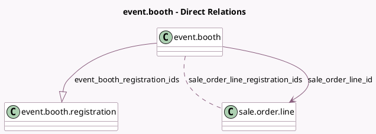

<!-- GENERATED:MODEL -->
---
tags: [odoo, community, generated, model]
---

# event.booth

- Module: [[docs/Community Addons/event_booth_sale/event_booth_sale|event_booth_sale]]
- Scope: Community Addons
- Defined in module: extension only
- Source files: `models/event_booth.py`
- Python classes: `EventBooth`

## Field footprint

- Detected fields: 5
- Field types: `Boolean` x 1, `Many2many` x 1, `Many2one` x 2, `One2many` x 1
- Relation fields: 4

## Sample fields

- `event_booth_registration_ids`: `One2many` (comodel `event.booth.registration`)
- `is_paid`: `Boolean` (comodel `Is Paid`)
- `sale_order_id`: `Many2one` (related `sale_order_line_id.order_id`)
- `sale_order_line_id`: `Many2one` (comodel `sale.order.line`)
- `sale_order_line_registration_ids`: `Many2many` (comodel `sale.order.line`)

## Method hints

- Detected methods: 4
- Action methods: `action_set_paid`, `action_view_sale_order`
- Compute methods: none
- Onchange methods: none

## Direct relation diagram

## Navigation

- **Parent:** [[docs/Community Addons/event_booth_sale/Models]]

<!-- GENERATED:MODEL -->
