<!-- GENERATED:MODEL -->
---
tags: [odoo, community, generated, model]
---

# event.booth.registration

- Module: [[docs/Community Addons/event_booth_sale/event_booth_sale|event_booth_sale]]
- Scope: Community Addons
- Defined in module: yes
- Source files: `models/event_booth_registration.py`
- Python classes: `EventBoothRegistration`
- Description: Event Booth Registration

## Field footprint

- Detected fields: 6
- Field types: `Char` x 3, `Many2one` x 3
- Relation fields: 3

## Sample fields

- `contact_email`: `Char` (compute `_compute_contact_email`, store `True`)
- `contact_name`: `Char` (compute `_compute_contact_name`, store `True`)
- `contact_phone`: `Char` (compute `_compute_contact_phone`, store `True`)
- `event_booth_id`: `Many2one` (comodel `event.booth`)
- `partner_id`: `Many2one` (comodel `res.partner`, related `sale_order_line_id.order_partner_id`, store `True`)
- `sale_order_line_id`: `Many2one` (comodel `sale.order.line`)

## Method hints

- Detected methods: 6
- Action methods: `action_confirm`
- Compute methods: `_compute_contact_email`, `_compute_contact_name`, `_compute_contact_phone`
- Onchange methods: none

## Direct relation diagram

```plantuml
@startuml
!define ODOO_COLOR_PRIMARY #714B67
!define ODOO_COLOR_ACCENT #875A7B
!define ODOO_COLOR_BG #FAF7FA

skinparam backgroundColor ODOO_COLOR_BG
skinparam defaultTextAlignment left
skinparam ArrowColor ODOO_COLOR_ACCENT
skinparam ClassBackgroundColor white
skinparam ClassBorderColor ODOO_COLOR_PRIMARY
skinparam ComponentBackgroundColor white
skinparam ComponentBorderColor ODOO_COLOR_PRIMARY
skinparam NoteBackgroundColor #FFF8FF
skinparam NoteBorderColor ODOO_COLOR_ACCENT
skinparam SequenceLifeLineBorderColor ODOO_COLOR_ACCENT
skinparam SequenceLifeLineBackgroundColor #FFFFFF
skinparam SequenceParticipantBorderColor ODOO_COLOR_PRIMARY
skinparam SequenceParticipantBackgroundColor #FFFFFF
skinparam sequence {
  ArrowColor ODOO_COLOR_ACCENT
  ActorBorderColor ODOO_COLOR_PRIMARY
}
title event.booth.registration - Direct Relations
class "event.booth.registration" as event_booth_registration
class "event.booth" as event_booth
class "res.partner" as res_partner
class "sale.order.line" as sale_order_line
event_booth_registration --> sale_order_line : sale_order_line_id
event_booth_registration --> event_booth : event_booth_id
event_booth_registration --> res_partner : partner_id
@enduml
```

## Navigation

- **Parent:** [[docs/Community Addons/event_booth_sale/Models]]

<!-- GENERATED:MODEL -->
