<!-- GENERATED:MODEL -->
---
tags: [odoo, community, generated, model]
---

# event.type.booth

- Module: [[docs/Community Addons/event_booth_sale/event_booth_sale|event_booth_sale]]
- Scope: Community Addons
- Defined in module: extension only
- Source files: `models/event_type_booth.py`
- Python classes: `EventTypeBooth`

## Field footprint

- Detected fields: 3
- Field types: `Float` x 1, `Many2one` x 2
- Relation fields: 2

## Sample fields

- `currency_id`: `Many2one` (related `booth_category_id.currency_id`)
- `price`: `Float` (related `booth_category_id.price`, store `True`)
- `product_id`: `Many2one` (related `booth_category_id.product_id`)

## Method hints

- Detected methods: 1
- Action methods: none
- Compute methods: none
- Onchange methods: none

## Direct relation diagram

```plantuml
@startuml
!define ODOO_COLOR_PRIMARY #714B67
!define ODOO_COLOR_ACCENT #875A7B
!define ODOO_COLOR_BG #FAF7FA

skinparam backgroundColor ODOO_COLOR_BG
skinparam defaultTextAlignment left
skinparam ArrowColor ODOO_COLOR_ACCENT
skinparam ClassBackgroundColor white
skinparam ClassBorderColor ODOO_COLOR_PRIMARY
skinparam ComponentBackgroundColor white
skinparam ComponentBorderColor ODOO_COLOR_PRIMARY
skinparam NoteBackgroundColor #FFF8FF
skinparam NoteBorderColor ODOO_COLOR_ACCENT
skinparam SequenceLifeLineBorderColor ODOO_COLOR_ACCENT
skinparam SequenceLifeLineBackgroundColor #FFFFFF
skinparam SequenceParticipantBorderColor ODOO_COLOR_PRIMARY
skinparam SequenceParticipantBackgroundColor #FFFFFF
skinparam sequence {
  ArrowColor ODOO_COLOR_ACCENT
  ActorBorderColor ODOO_COLOR_PRIMARY
}
title event.type.booth - Direct Relations
class "event.type.booth" as event_type_booth
@enduml
```

## Navigation

- **Parent:** [[docs/Community Addons/event_booth_sale/Models]]

<!-- GENERATED:MODEL -->
