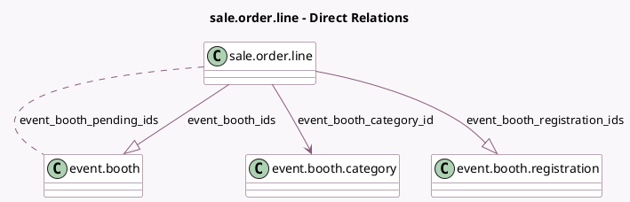

<!-- GENERATED:MODEL -->
---
tags: [odoo, community, generated, model]
---

# sale.order.line

- Module: [[docs/Community Addons/event_booth_sale/event_booth_sale|event_booth_sale]]
- Scope: Community Addons
- Defined in module: extension only
- Source files: `models/sale_order_line.py`
- Python classes: `SaleOrderLine`

## Field footprint

- Detected fields: 4
- Field types: `Many2many` x 1, `Many2one` x 1, `One2many` x 2
- Relation fields: 4

## Sample fields

- `event_booth_category_id`: `Many2one` (comodel `event.booth.category`)
- `event_booth_ids`: `One2many` (comodel `event.booth`)
- `event_booth_pending_ids`: `Many2many` (comodel `event.booth`, compute `_compute_event_booth_pending_ids`)
- `event_booth_registration_ids`: `One2many` (comodel `event.booth.registration`)

## Method hints

- Detected methods: 11
- Action methods: none
- Compute methods: `_compute_event_booth_pending_ids`, `_compute_name`
- Onchange methods: `_onchange_event_id_booth`, `_onchange_product_id_booth`

## Direct relation diagram

## Navigation

- **Parent:** [[docs/Community Addons/event_booth_sale/Models]]

<!-- GENERATED:MODEL -->
