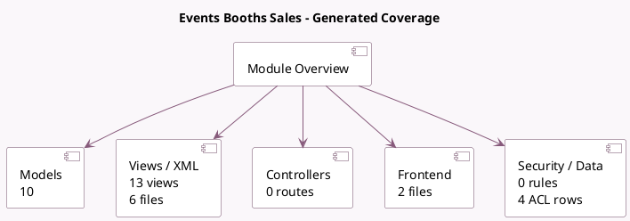

<!-- GENERATED:MODULE -->
---
tags: [odoo, community, module]
---

# Events Booths Sales

- Scope: Community Addons
- Source: odoo/addons/event_booth_sale
- Dependencies: [[docs/Community Addons/event_booth/event_booth|event_booth]], [[docs/Community Addons/event_sale/event_sale|event_sale]]

## Summary

Manage event booths sale

## Generated coverage

- Models: 10
- XML files with UI/data artifacts: 6
- Views: 13
- Actions: 1
- Menus: 0
- Rules (ir.rule): 0
- Access CSV entries: 4
- Controller units: 0
- Frontend asset files: 2

## Module map

## Detail notes

- Models: [[docs/Community Addons/event_booth_sale/Models|Models]] (10)
- Views and XML: [[docs/Community Addons/event_booth_sale/Views|Views]] (6 files)
- Frontend: [[docs/Community Addons/event_booth_sale/Frontend|Frontend]] (2 files)

## Key models

- `account.move`
- `event.booth`
- `event.booth.category`
- `event.booth.configurator`
- `event.booth.registration`
- `event.type.booth`
- `product.product`
- `product.template`
- `sale.order`
- `sale.order.line`

## Navigation

- [[../Community Addons/Community Addons|Back to scope]]
- [[../../docs/docs|Back to docs]]

<!-- GENERATED:MODULE -->

