<!-- GENERATED:MODEL -->
---
tags: [odoo, community, generated, model]
---

# crm.lead

- Module: [[docs/Community Addons/event_crm/event_crm|event_crm]]
- Scope: Community Addons
- Defined in module: extension only
- Source files: `models/crm_lead.py`
- Python classes: `CrmLead`

## Field footprint

- Detected fields: 4
- Field types: `Integer` x 1, `Many2many` x 1, `Many2one` x 2
- Relation fields: 3

## Sample fields

- `event_id`: `Many2one` (comodel `event.event`)
- `event_lead_rule_id`: `Many2one` (comodel `event.lead.rule`)
- `registration_count`: `Integer` (compute `_compute_registration_count`)
- `registration_ids`: `Many2many` (comodel `event.registration`)

## Method hints

- Detected methods: 3
- Action methods: none
- Compute methods: `_compute_registration_count`
- Onchange methods: none

## Direct relation diagram

```plantuml
@startuml
!define ODOO_COLOR_PRIMARY #714B67
!define ODOO_COLOR_ACCENT #875A7B
!define ODOO_COLOR_BG #FAF7FA

skinparam backgroundColor ODOO_COLOR_BG
skinparam defaultTextAlignment left
skinparam ArrowColor ODOO_COLOR_ACCENT
skinparam ClassBackgroundColor white
skinparam ClassBorderColor ODOO_COLOR_PRIMARY
skinparam ComponentBackgroundColor white
skinparam ComponentBorderColor ODOO_COLOR_PRIMARY
skinparam NoteBackgroundColor #FFF8FF
skinparam NoteBorderColor ODOO_COLOR_ACCENT
skinparam SequenceLifeLineBorderColor ODOO_COLOR_ACCENT
skinparam SequenceLifeLineBackgroundColor #FFFFFF
skinparam SequenceParticipantBorderColor ODOO_COLOR_PRIMARY
skinparam SequenceParticipantBackgroundColor #FFFFFF
skinparam sequence {
  ArrowColor ODOO_COLOR_ACCENT
  ActorBorderColor ODOO_COLOR_PRIMARY
}
title crm.lead - Direct Relations
class "crm.lead" as crm_lead
class "event.event" as event_event
class "event.lead.rule" as event_lead_rule
class "event.registration" as event_registration
crm_lead --> event_lead_rule : event_lead_rule_id
crm_lead --> event_event : event_id
crm_lead .. event_registration : registration_ids
@enduml
```

## Navigation

- **Parent:** [[docs/Community Addons/event_crm/Models]]

<!-- GENERATED:MODEL -->
