<!-- GENERATED:MODEL -->
---
tags: [odoo, community, generated, model]
---

# event.lead.request

- Module: [[docs/Community Addons/event_crm/event_crm|event_crm]]
- Scope: Community Addons
- Defined in module: yes
- Source files: `models/event_lead_request.py`
- Python classes: `EventLeadRequest`
- Description: Event Lead Request

## Field footprint

- Detected fields: 3
- Field types: `Integer` x 1, `Many2many` x 1, `Many2one` x 1
- Relation fields: 2

## Sample fields

- `event_id`: `Many2one` (comodel `event.event`)
- `event_lead_rule_ids`: `Many2many` (comodel `event.lead.rule`)
- `processed_registration_id`: `Integer` (comodel `Processed Registration`)

## Method hints

- Detected methods: 1
- Action methods: none
- Compute methods: none
- Onchange methods: none

## Direct relation diagram

```plantuml
@startuml
!define ODOO_COLOR_PRIMARY #714B67
!define ODOO_COLOR_ACCENT #875A7B
!define ODOO_COLOR_BG #FAF7FA

skinparam backgroundColor ODOO_COLOR_BG
skinparam defaultTextAlignment left
skinparam ArrowColor ODOO_COLOR_ACCENT
skinparam ClassBackgroundColor white
skinparam ClassBorderColor ODOO_COLOR_PRIMARY
skinparam ComponentBackgroundColor white
skinparam ComponentBorderColor ODOO_COLOR_PRIMARY
skinparam NoteBackgroundColor #FFF8FF
skinparam NoteBorderColor ODOO_COLOR_ACCENT
skinparam SequenceLifeLineBorderColor ODOO_COLOR_ACCENT
skinparam SequenceLifeLineBackgroundColor #FFFFFF
skinparam SequenceParticipantBorderColor ODOO_COLOR_PRIMARY
skinparam SequenceParticipantBackgroundColor #FFFFFF
skinparam sequence {
  ArrowColor ODOO_COLOR_ACCENT
  ActorBorderColor ODOO_COLOR_PRIMARY
}
title event.lead.request - Direct Relations
class "event.lead.request" as event_lead_request
class "event.event" as event_event
class "event.lead.rule" as event_lead_rule
event_lead_request --> event_event : event_id
event_lead_request .. event_lead_rule : event_lead_rule_ids
@enduml
```

## Navigation

- **Parent:** [[docs/Community Addons/event_crm/Models]]

<!-- GENERATED:MODEL -->
