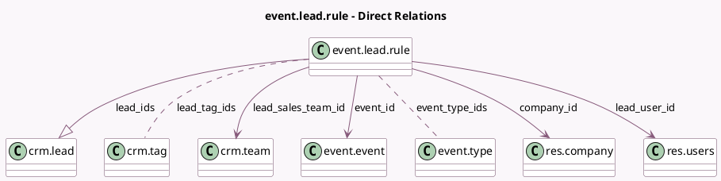

<!-- GENERATED:MODEL -->
---
tags: [odoo, community, generated, model]
---

# event.lead.rule

- Module: [[docs/Community Addons/event_crm/event_crm|event_crm]]
- Scope: Community Addons
- Defined in module: yes
- Source files: `models/event_lead_rule.py`
- Python classes: `EventLeadRule`
- Description: Event Lead Rules

## Field footprint

- Detected fields: 13
- Field types: `Boolean` x 1, `Char` x 1, `Many2many` x 2, `Many2one` x 4, `One2many` x 1, `Selection` x 3, `Text` x 1
- Relation fields: 7

## Sample fields

- `active`: `Boolean` (comodel `Active`)
- `company_id`: `Many2one` (comodel `res.company`)
- `event_id`: `Many2one` (comodel `event.event`)
- `event_registration_filter`: `Text`
- `event_type_ids`: `Many2many` (comodel `event.type`)
- `lead_creation_basis`: `Selection`
- `lead_creation_trigger`: `Selection`
- `lead_ids`: `One2many` (comodel `crm.lead`)
- `lead_sales_team_id`: `Many2one` (comodel `crm.team`)
- `lead_tag_ids`: `Many2many` (comodel `crm.tag`)
- `lead_type`: `Selection`
- `lead_user_id`: `Many2one` (comodel `res.users`)
- `name`: `Char` (comodel `Rule Name`)

## Method hints

- Detected methods: 4
- Action methods: `action_execute_rule`
- Compute methods: none
- Onchange methods: `_onchange_lead_sales_team_id`

## Direct relation diagram

## Navigation

- **Parent:** [[docs/Community Addons/event_crm/Models]]

<!-- GENERATED:MODEL -->
