<!-- GENERATED:MODEL -->
---
tags: [odoo, community, generated, model]
---

# event.type.ticket

- Module: [[docs/Community Addons/event_product/event_product|event_product]]
- Scope: Community Addons
- Defined in module: extension only
- Source files: `models/event_type_ticket.py`
- Python classes: `EventTypeTicket`

## Field footprint

- Detected fields: 5
- Field types: `Float` x 2, `Many2one` x 2, `Text` x 1
- Relation fields: 2

## Sample fields

- `currency_id`: `Many2one` (related `product_id.currency_id`)
- `description`: `Text` (compute `_compute_description`, store `True`)
- `price`: `Float` (compute `_compute_price`, store `True`)
- `price_reduce`: `Float` (compute `_compute_price_reduce`)
- `product_id`: `Many2one` (comodel `product.product`)

## Method hints

- Detected methods: 6
- Action methods: none
- Compute methods: `_compute_description`, `_compute_price`, `_compute_price_reduce`
- Onchange methods: none

## Direct relation diagram

```plantuml
@startuml
!define ODOO_COLOR_PRIMARY #714B67
!define ODOO_COLOR_ACCENT #875A7B
!define ODOO_COLOR_BG #FAF7FA

skinparam backgroundColor ODOO_COLOR_BG
skinparam defaultTextAlignment left
skinparam ArrowColor ODOO_COLOR_ACCENT
skinparam ClassBackgroundColor white
skinparam ClassBorderColor ODOO_COLOR_PRIMARY
skinparam ComponentBackgroundColor white
skinparam ComponentBorderColor ODOO_COLOR_PRIMARY
skinparam NoteBackgroundColor #FFF8FF
skinparam NoteBorderColor ODOO_COLOR_ACCENT
skinparam SequenceLifeLineBorderColor ODOO_COLOR_ACCENT
skinparam SequenceLifeLineBackgroundColor #FFFFFF
skinparam SequenceParticipantBorderColor ODOO_COLOR_PRIMARY
skinparam SequenceParticipantBackgroundColor #FFFFFF
skinparam sequence {
  ArrowColor ODOO_COLOR_ACCENT
  ActorBorderColor ODOO_COLOR_PRIMARY
}
title event.type.ticket - Direct Relations
class "event.type.ticket" as event_type_ticket
class "product.product" as product_product
event_type_ticket --> product_product : product_id
@enduml
```

## Navigation

- **Parent:** [[docs/Community Addons/event_product/Models]]

<!-- GENERATED:MODEL -->
