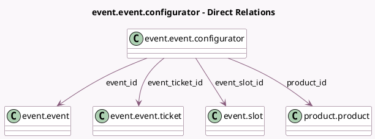

<!-- GENERATED:MODEL -->
---
tags: [odoo, community, generated, model]
---

# event.event.configurator

- Module: [[docs/Community Addons/event_sale/event_sale|event_sale]]
- Scope: Community Addons
- Defined in module: yes
- Source files: `wizard/event_configurator.py`
- Python classes: `EventEventConfigurator`
- Description: Event Configurator

## Field footprint

- Detected fields: 6
- Field types: `Boolean` x 2, `Many2one` x 4
- Relation fields: 4

## Sample fields

- `event_id`: `Many2one` (comodel `event.event`)
- `event_slot_id`: `Many2one` (comodel `event.slot`, compute `_compute_event_slot_id`, store `True`)
- `event_ticket_id`: `Many2one` (comodel `event.event.ticket`, compute `_compute_event_ticket_id`, store `True`)
- `has_available_tickets`: `Boolean` (comodel `Has Available Tickets`, compute `_compute_has_available_tickets`)
- `is_multi_slots`: `Boolean` (related `event_id.is_multi_slots`)
- `product_id`: `Many2one` (comodel `product.product`)

## Method hints

- Detected methods: 4
- Action methods: none
- Compute methods: `_compute_event_slot_id`, `_compute_event_ticket_id`, `_compute_has_available_tickets`
- Onchange methods: none

## Direct relation diagram

## Navigation

- **Parent:** [[docs/Community Addons/event_sale/Models]]

<!-- GENERATED:MODEL -->
