<!-- GENERATED:MODEL -->
---
tags: [odoo, community, generated, model]
---

# event.registration

- Module: [[docs/Community Addons/event_sale/event_sale|event_sale]]
- Scope: Community Addons
- Defined in module: extension only
- Source files: `models/event_registration.py`
- Python classes: `EventRegistration`

## Field footprint

- Detected fields: 6
- Field types: `Many2one` x 5, `Selection` x 1
- Relation fields: 5

## Sample fields

- `sale_order_id`: `Many2one` (comodel `sale.order`)
- `sale_order_line_id`: `Many2one` (comodel `sale.order.line`)
- `state`: `Selection` (compute `_compute_registration_status`, store `True`)
- `utm_campaign_id`: `Many2one` (compute `_compute_utm_campaign_id`, store `True`)
- `utm_medium_id`: `Many2one` (compute `_compute_utm_medium_id`, store `True`)
- `utm_source_id`: `Many2one` (compute `_compute_utm_source_id`, store `True`)

## Method hints

- Detected methods: 13
- Action methods: `action_view_sale_order`
- Compute methods: `_compute_field_value`, `_compute_registration_status`, `_compute_utm_campaign_id`, `_compute_utm_medium_id`, `_compute_utm_source_id`
- Onchange methods: none

## Direct relation diagram

```plantuml
@startuml
!define ODOO_COLOR_PRIMARY #714B67
!define ODOO_COLOR_ACCENT #875A7B
!define ODOO_COLOR_BG #FAF7FA

skinparam backgroundColor ODOO_COLOR_BG
skinparam defaultTextAlignment left
skinparam ArrowColor ODOO_COLOR_ACCENT
skinparam ClassBackgroundColor white
skinparam ClassBorderColor ODOO_COLOR_PRIMARY
skinparam ComponentBackgroundColor white
skinparam ComponentBorderColor ODOO_COLOR_PRIMARY
skinparam NoteBackgroundColor #FFF8FF
skinparam NoteBorderColor ODOO_COLOR_ACCENT
skinparam SequenceLifeLineBorderColor ODOO_COLOR_ACCENT
skinparam SequenceLifeLineBackgroundColor #FFFFFF
skinparam SequenceParticipantBorderColor ODOO_COLOR_PRIMARY
skinparam SequenceParticipantBackgroundColor #FFFFFF
skinparam sequence {
  ArrowColor ODOO_COLOR_ACCENT
  ActorBorderColor ODOO_COLOR_PRIMARY
}
title event.registration - Direct Relations
class "event.registration" as event_registration
class "sale.order" as sale_order
class "sale.order.line" as sale_order_line
event_registration --> sale_order : sale_order_id
event_registration --> sale_order_line : sale_order_line_id
@enduml
```

## Navigation

- **Parent:** [[docs/Community Addons/event_sale/Models]]

<!-- GENERATED:MODEL -->
