<!-- GENERATED:MODEL -->
---
tags: [odoo, community, generated, model]
---

# event.sale.report

- Module: [[docs/Community Addons/event_sale/event_sale|event_sale]]
- Scope: Community Addons
- Defined in module: yes
- Source files: `report/event_sale_report.py`
- Python classes: `EventSaleReport`
- Description: Event Sales Report

## Field footprint

- Detected fields: 24
- Field types: `Boolean` x 1, `Char` x 1, `Date` x 3, `Datetime` x 1, `Float` x 3, `Many2one` x 12, `Selection` x 3
- Relation fields: 12

## Sample fields

- `active`: `Boolean` (comodel `Is registration active (not archived)?`)
- `company_id`: `Many2one` (comodel `res.company`)
- `event_date_begin`: `Date`
- `event_date_end`: `Date`
- `event_id`: `Many2one` (comodel `event.event`)
- `event_registration_create_date`: `Date`
- `event_registration_id`: `Many2one` (comodel `event.registration`)
- `event_registration_name`: `Char` (comodel `Attendee Name`)
- `event_registration_state`: `Selection`
- `event_slot_id`: `Many2one` (comodel `event.slot`)
- `event_ticket_id`: `Many2one` (comodel `event.event.ticket`)
- `event_ticket_price`: `Float`
- `event_type_id`: `Many2one` (comodel `event.type`)
- `invoice_partner_id`: `Many2one` (comodel `res.partner`)
- `product_id`: `Many2one` (comodel `product.product`)
- `sale_order_date`: `Datetime` (comodel `Order Date`)
- `sale_order_id`: `Many2one` (comodel `sale.order`)
- `sale_order_line_id`: `Many2one` (comodel `sale.order.line`)
- `sale_order_partner_id`: `Many2one` (comodel `res.partner`)
- `sale_order_state`: `Selection`

## Method hints

- Detected methods: 6
- Action methods: none
- Compute methods: none
- Onchange methods: none

## Direct relation diagram

```plantuml
@startuml
!define ODOO_COLOR_PRIMARY #714B67
!define ODOO_COLOR_ACCENT #875A7B
!define ODOO_COLOR_BG #FAF7FA

skinparam backgroundColor ODOO_COLOR_BG
skinparam defaultTextAlignment left
skinparam ArrowColor ODOO_COLOR_ACCENT
skinparam ClassBackgroundColor white
skinparam ClassBorderColor ODOO_COLOR_PRIMARY
skinparam ComponentBackgroundColor white
skinparam ComponentBorderColor ODOO_COLOR_PRIMARY
skinparam NoteBackgroundColor #FFF8FF
skinparam NoteBorderColor ODOO_COLOR_ACCENT
skinparam SequenceLifeLineBorderColor ODOO_COLOR_ACCENT
skinparam SequenceLifeLineBackgroundColor #FFFFFF
skinparam SequenceParticipantBorderColor ODOO_COLOR_PRIMARY
skinparam SequenceParticipantBackgroundColor #FFFFFF
skinparam sequence {
  ArrowColor ODOO_COLOR_ACCENT
  ActorBorderColor ODOO_COLOR_PRIMARY
}
title event.sale.report - Direct Relations
class "event.sale.report" as event_sale_report
class "event.event" as event_event
class "event.event.ticket" as event_event_ticket
class "event.registration" as event_registration
class "event.slot" as event_slot
class "event.type" as event_type
class "product.product" as product_product
class "res.company" as res_company
class "res.partner" as res_partner
class "res.users" as res_users
class "sale.order" as sale_order
class "sale.order.line" as sale_order_line
event_sale_report --> event_type : event_type_id
event_sale_report --> event_event : event_id
event_sale_report --> event_slot : event_slot_id
event_sale_report --> event_event_ticket : event_ticket_id
event_sale_report --> event_registration : event_registration_id
event_sale_report --> product_product : product_id
event_sale_report --> sale_order : sale_order_id
event_sale_report --> res_partner : sale_order_partner_id
event_sale_report --> res_users : sale_order_user_id
event_sale_report --> sale_order_line : sale_order_line_id
event_sale_report --> res_partner : invoice_partner_id
event_sale_report --> res_company : company_id
@enduml
```

## Navigation

- **Parent:** [[docs/Community Addons/event_sale/Models]]

<!-- GENERATED:MODEL -->
