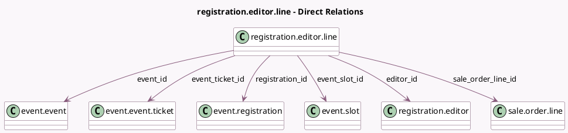

<!-- GENERATED:MODEL -->
---
tags: [odoo, community, generated, model]
---

# registration.editor.line

- Module: [[docs/Community Addons/event_sale/event_sale|event_sale]]
- Scope: Community Addons
- Defined in module: yes
- Source files: `wizard/event_edit_registration.py`
- Python classes: `RegistrationEditorLine`
- Description: Edit Attendee Line on Sales Confirmation

## Field footprint

- Detected fields: 10
- Field types: `Char` x 3, `Many2one` x 7
- Relation fields: 7

## Sample fields

- `company_id`: `Many2one` (related `event_id.company_id`)
- `editor_id`: `Many2one` (comodel `registration.editor`)
- `email`: `Char`
- `event_id`: `Many2one` (comodel `event.event`)
- `event_slot_id`: `Many2one` (comodel `event.slot`)
- `event_ticket_id`: `Many2one` (comodel `event.event.ticket`)
- `name`: `Char`
- `phone`: `Char`
- `registration_id`: `Many2one` (comodel `event.registration`)
- `sale_order_line_id`: `Many2one` (comodel `sale.order.line`)

## Method hints

- Detected methods: 1
- Action methods: none
- Compute methods: none
- Onchange methods: none

## Direct relation diagram

## Navigation

- **Parent:** [[docs/Community Addons/event_sale/Models]]

<!-- GENERATED:MODEL -->
