<!-- GENERATED:MODEL -->
---
tags: [odoo, community, generated, model]
---

# registration.editor

- Module: [[docs/Community Addons/event_sale/event_sale|event_sale]]
- Scope: Community Addons
- Defined in module: yes
- Source files: `wizard/event_edit_registration.py`
- Python classes: `RegistrationEditor`
- Description: Edit Attendee Details on Sales Confirmation

## Field footprint

- Detected fields: 2
- Field types: `Many2one` x 1, `One2many` x 1
- Relation fields: 2

## Sample fields

- `event_registration_ids`: `One2many` (comodel `registration.editor.line`)
- `sale_order_id`: `Many2one` (comodel `sale.order`)

## Method hints

- Detected methods: 2
- Action methods: `action_make_registration`
- Compute methods: none
- Onchange methods: none

## Direct relation diagram

```plantuml
@startuml
!define ODOO_COLOR_PRIMARY #714B67
!define ODOO_COLOR_ACCENT #875A7B
!define ODOO_COLOR_BG #FAF7FA

skinparam backgroundColor ODOO_COLOR_BG
skinparam defaultTextAlignment left
skinparam ArrowColor ODOO_COLOR_ACCENT
skinparam ClassBackgroundColor white
skinparam ClassBorderColor ODOO_COLOR_PRIMARY
skinparam ComponentBackgroundColor white
skinparam ComponentBorderColor ODOO_COLOR_PRIMARY
skinparam NoteBackgroundColor #FFF8FF
skinparam NoteBorderColor ODOO_COLOR_ACCENT
skinparam SequenceLifeLineBorderColor ODOO_COLOR_ACCENT
skinparam SequenceLifeLineBackgroundColor #FFFFFF
skinparam SequenceParticipantBorderColor ODOO_COLOR_PRIMARY
skinparam SequenceParticipantBackgroundColor #FFFFFF
skinparam sequence {
  ArrowColor ODOO_COLOR_ACCENT
  ActorBorderColor ODOO_COLOR_PRIMARY
}
title registration.editor - Direct Relations
class "registration.editor" as registration_editor
class "registration.editor.line" as registration_editor_line
class "sale.order" as sale_order
registration_editor --> sale_order : sale_order_id
registration_editor --|> registration_editor_line : event_registration_ids
@enduml
```

## Navigation

- **Parent:** [[docs/Community Addons/event_sale/Models]]

<!-- GENERATED:MODEL -->
