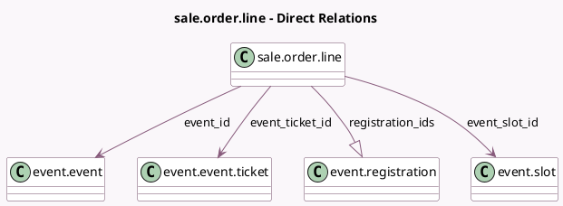

<!-- GENERATED:MODEL -->
---
tags: [odoo, community, generated, model]
---

# sale.order.line

- Module: [[docs/Community Addons/event_sale/event_sale|event_sale]]
- Scope: Community Addons
- Defined in module: extension only
- Source files: `models/sale_order_line.py`
- Python classes: `SaleOrderLine`

## Field footprint

- Detected fields: 5
- Field types: `Boolean` x 1, `Many2one` x 3, `One2many` x 1
- Relation fields: 4

## Sample fields

- `event_id`: `Many2one` (comodel `event.event`, compute `_compute_event_id`, store `True`)
- `event_slot_id`: `Many2one` (comodel `event.slot`, compute `_compute_event_related`, store `True`)
- `event_ticket_id`: `Many2one` (comodel `event.event.ticket`, compute `_compute_event_related`, store `True`)
- `is_multi_slots`: `Boolean` (related `event_id.is_multi_slots`)
- `registration_ids`: `One2many` (comodel `event.registration`)

## Method hints

- Detected methods: 10
- Action methods: none
- Compute methods: `_compute_event_id`, `_compute_event_related`, `_compute_name`, `_compute_price_unit`, `_compute_product_uom_readonly`
- Onchange methods: none

## Direct relation diagram

## Navigation

- **Parent:** [[docs/Community Addons/event_sale/Models]]

<!-- GENERATED:MODEL -->
