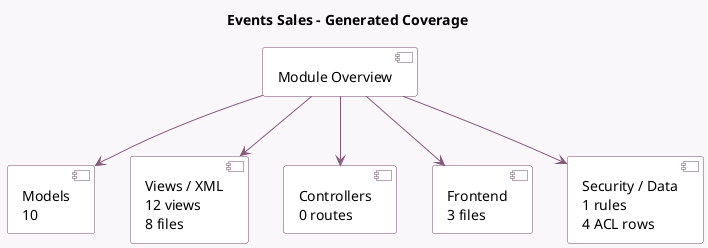

<!-- GENERATED:MODULE -->
---
tags: [odoo, community, module]
---

# Events Sales

- Scope: Community Addons
- Source: odoo/addons/event_sale
- Dependencies: [[docs/Community Addons/event_product/event_product|event_product]], [[docs/Community Addons/sale_management/sale_management|sale_management]]

## Generated coverage

- Models: 10
- XML files with UI/data artifacts: 8
- Views: 12
- Actions: 3
- Menus: 1
- Rules (ir.rule): 1
- Access CSV entries: 4
- Controller units: 0
- Frontend asset files: 3

## Module map

## Detail notes

- Models: [[docs/Community Addons/event_sale/Models|Models]] (10)
- Views and XML: [[docs/Community Addons/event_sale/Views|Views]] (8 files)
- Frontend: [[docs/Community Addons/event_sale/Frontend|Frontend]] (3 files)

## Key models

- `event.event`
- `event.event.configurator`
- `event.event.ticket`
- `event.registration`
- `event.sale.report`
- `product.template`
- `registration.editor`
- `registration.editor.line`
- `sale.order`
- `sale.order.line`

## Navigation

- [[../Community Addons/Community Addons|Back to scope]]
- [[../../docs/docs|Back to docs]]

<!-- GENERATED:MODULE -->

