<!-- GENERATED:MODEL -->
---
tags: [odoo, community, generated, model]
---

# fleet.vehicle.cost.report

- Module: [[docs/Community Addons/fleet/fleet|fleet]]
- Scope: Community Addons
- Defined in module: yes
- Source files: `report/fleet_report.py`
- Python classes: `FleetVehicleCostReport`
- Description: Fleet Analysis Report

## Field footprint

- Detected fields: 9
- Field types: `Char` x 2, `Date` x 1, `Float` x 1, `Many2one` x 3, `Selection` x 2
- Relation fields: 3

## Sample fields

- `company_id`: `Many2one` (comodel `res.company`)
- `cost`: `Float` (comodel `Cost`)
- `cost_type`: `Selection`
- `date_start`: `Date` (comodel `Date`)
- `driver_id`: `Many2one` (comodel `res.partner`)
- `fuel_type`: `Char` (comodel `Fuel`)
- `name`: `Char` (comodel `Vehicle Name`)
- `vehicle_id`: `Many2one` (comodel `fleet.vehicle`)
- `vehicle_type`: `Selection`

## Method hints

- Detected methods: 1
- Action methods: none
- Compute methods: none
- Onchange methods: none

## Direct relation diagram

```plantuml
@startuml
!define ODOO_COLOR_PRIMARY #714B67
!define ODOO_COLOR_ACCENT #875A7B
!define ODOO_COLOR_BG #FAF7FA

skinparam backgroundColor ODOO_COLOR_BG
skinparam defaultTextAlignment left
skinparam ArrowColor ODOO_COLOR_ACCENT
skinparam ClassBackgroundColor white
skinparam ClassBorderColor ODOO_COLOR_PRIMARY
skinparam ComponentBackgroundColor white
skinparam ComponentBorderColor ODOO_COLOR_PRIMARY
skinparam NoteBackgroundColor #FFF8FF
skinparam NoteBorderColor ODOO_COLOR_ACCENT
skinparam SequenceLifeLineBorderColor ODOO_COLOR_ACCENT
skinparam SequenceLifeLineBackgroundColor #FFFFFF
skinparam SequenceParticipantBorderColor ODOO_COLOR_PRIMARY
skinparam SequenceParticipantBackgroundColor #FFFFFF
skinparam sequence {
  ArrowColor ODOO_COLOR_ACCENT
  ActorBorderColor ODOO_COLOR_PRIMARY
}
title fleet.vehicle.cost.report - Direct Relations
class "fleet.vehicle.cost.report" as fleet_vehicle_cost_report
class "fleet.vehicle" as fleet_vehicle
class "res.company" as res_company
class "res.partner" as res_partner
fleet_vehicle_cost_report --> res_company : company_id
fleet_vehicle_cost_report --> fleet_vehicle : vehicle_id
fleet_vehicle_cost_report --> res_partner : driver_id
@enduml
```

## Navigation

- **Parent:** [[docs/Community Addons/fleet/Models]]

<!-- GENERATED:MODEL -->
