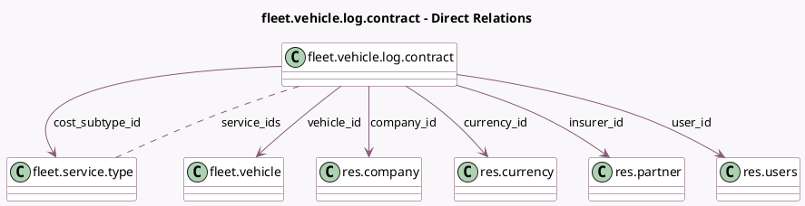

<!-- GENERATED:MODEL -->
---
tags: [odoo, community, generated, model]
---

# fleet.vehicle.log.contract

- Module: [[docs/Community Addons/fleet/fleet|fleet]]
- Scope: Community Addons
- Defined in module: yes
- Source files: `models/fleet_vehicle_log_contract.py`
- Python classes: `FleetVehicleLogContract`
- Description: Vehicle Contract
- Inherits: `mail.activity.mixin`, `mail.thread`

## Field footprint

- Detected fields: 22
- Field types: `Boolean` x 3, `Char` x 2, `Date` x 3, `Html` x 1, `Integer` x 1, `Many2many` x 1, `Many2one` x 7, `Monetary` x 2, `Selection` x 2
- Relation fields: 8

## Sample fields

- `active`: `Boolean`
- `amount`: `Monetary` (comodel `Cost`)
- `company_id`: `Many2one` (comodel `res.company`)
- `cost_frequency`: `Selection`
- `cost_generated`: `Monetary` (comodel `Recurring Cost`)
- `cost_subtype_id`: `Many2one` (comodel `fleet.service.type`)
- `currency_id`: `Many2one` (comodel `res.currency`, related `company_id.currency_id`)
- `date`: `Date`
- `days_left`: `Integer` (compute `_compute_days_left`)
- `expiration_date`: `Date` (comodel `Contract Expiration Date`)
- `expires_today`: `Boolean` (compute `_compute_days_left`)
- `has_open_contract`: `Boolean` (compute `_compute_has_open_contract`)
- `ins_ref`: `Char` (comodel `Reference`)
- `insurer_id`: `Many2one` (comodel `res.partner`)
- `name`: `Char` (compute `_compute_contract_name`, store `True`)
- `notes`: `Html` (comodel `Terms and Conditions`)
- `purchaser_id`: `Many2one` (related `vehicle_id.driver_id`)
- `service_ids`: `Many2many` (comodel `fleet.service.type`)
- `start_date`: `Date` (comodel `Contract Start Date`)
- `state`: `Selection`

## Method hints

- Detected methods: 11
- Action methods: `action_close`, `action_draft`, `action_expire`, `action_open`
- Compute methods: `_compute_contract_name`, `_compute_days_left`, `_compute_has_open_contract`
- Onchange methods: none

## Direct relation diagram

## Navigation

- **Parent:** [[docs/Community Addons/fleet/Models]]

<!-- GENERATED:MODEL -->
