<!-- GENERATED:MODEL -->
---
tags: [odoo, community, generated, model]
---

# fleet.vehicle.log.services

- Module: [[docs/Community Addons/fleet/fleet|fleet]]
- Scope: Community Addons
- Defined in module: yes
- Source files: `models/fleet_vehicle_log_services.py`
- Python classes: `FleetVehicleLogServices`
- Description: Services for vehicles
- Inherits: `mail.activity.mixin`, `mail.thread`

## Field footprint

- Detected fields: 19
- Field types: `Boolean` x 1, `Char` x 2, `Date` x 1, `Float` x 1, `Many2one` x 10, `Monetary` x 1, `Selection` x 2, `Text` x 1
- Relation fields: 10

## Sample fields

- `active`: `Boolean`
- `amount`: `Monetary` (comodel `Cost`)
- `brand_id`: `Many2one` (comodel `fleet.vehicle.model.brand`, related `vehicle_id.model_id.brand_id`, store `True`)
- `company_id`: `Many2one` (comodel `res.company`)
- `currency_id`: `Many2one` (comodel `res.currency`, related `company_id.currency_id`)
- `date`: `Date`
- `description`: `Char` (comodel `Description`)
- `inv_ref`: `Char` (comodel `Vendor Reference`)
- `manager_id`: `Many2one` (comodel `res.users`, related `vehicle_id.manager_id`, store `True`)
- `model_id`: `Many2one` (comodel `fleet.vehicle.model`, related `vehicle_id.model_id`, store `True`)
- `notes`: `Text`
- `odometer`: `Float` (compute `_get_odometer`)
- `odometer_id`: `Many2one` (comodel `fleet.vehicle.odometer`)
- `odometer_unit`: `Selection` (related `vehicle_id.odometer_unit`)
- `purchaser_id`: `Many2one` (comodel `res.partner`, compute `_compute_purchaser_id`, store `True`)
- `service_type_id`: `Many2one` (comodel `fleet.service.type`)
- `state`: `Selection`
- `vehicle_id`: `Many2one` (comodel `fleet.vehicle`)
- `vendor_id`: `Many2one` (comodel `res.partner`)

## Method hints

- Detected methods: 4
- Action methods: none
- Compute methods: `_compute_purchaser_id`
- Onchange methods: none

## Direct relation diagram

```plantuml
@startuml
!define ODOO_COLOR_PRIMARY #714B67
!define ODOO_COLOR_ACCENT #875A7B
!define ODOO_COLOR_BG #FAF7FA

skinparam backgroundColor ODOO_COLOR_BG
skinparam defaultTextAlignment left
skinparam ArrowColor ODOO_COLOR_ACCENT
skinparam ClassBackgroundColor white
skinparam ClassBorderColor ODOO_COLOR_PRIMARY
skinparam ComponentBackgroundColor white
skinparam ComponentBorderColor ODOO_COLOR_PRIMARY
skinparam NoteBackgroundColor #FFF8FF
skinparam NoteBorderColor ODOO_COLOR_ACCENT
skinparam SequenceLifeLineBorderColor ODOO_COLOR_ACCENT
skinparam SequenceLifeLineBackgroundColor #FFFFFF
skinparam SequenceParticipantBorderColor ODOO_COLOR_PRIMARY
skinparam SequenceParticipantBackgroundColor #FFFFFF
skinparam sequence {
  ArrowColor ODOO_COLOR_ACCENT
  ActorBorderColor ODOO_COLOR_PRIMARY
}
title fleet.vehicle.log.services - Direct Relations
class "fleet.vehicle.log.services" as fleet_vehicle_log_services
class "fleet.service.type" as fleet_service_type
class "fleet.vehicle" as fleet_vehicle
class "fleet.vehicle.model" as fleet_vehicle_model
class "fleet.vehicle.model.brand" as fleet_vehicle_model_brand
class "fleet.vehicle.odometer" as fleet_vehicle_odometer
class "res.company" as res_company
class "res.currency" as res_currency
class "res.partner" as res_partner
class "res.users" as res_users
fleet_vehicle_log_services --> fleet_vehicle : vehicle_id
fleet_vehicle_log_services --> fleet_vehicle_model : model_id
fleet_vehicle_log_services --> fleet_vehicle_model_brand : brand_id
fleet_vehicle_log_services --> res_users : manager_id
fleet_vehicle_log_services --> fleet_vehicle_odometer : odometer_id
fleet_vehicle_log_services --> res_company : company_id
fleet_vehicle_log_services --> res_currency : currency_id
fleet_vehicle_log_services --> res_partner : purchaser_id
fleet_vehicle_log_services --> res_partner : vendor_id
fleet_vehicle_log_services --> fleet_service_type : service_type_id
@enduml
```

## Navigation

- **Parent:** [[docs/Community Addons/fleet/Models]]

<!-- GENERATED:MODEL -->
