<!-- GENERATED:MODEL -->
---
tags: [odoo, community, generated, model]
---

# fleet.vehicle

- Module: [[docs/Community Addons/fleet/fleet|fleet]]
- Scope: Community Addons
- Defined in module: yes
- Source files: `models/fleet_vehicle.py`
- Python classes: `FleetVehicle`
- Description: Vehicle
- Inherits: `avatar.mixin`, `mail.activity.mixin`, `mail.thread`

## Field footprint

- Detected fields: 63
- Field types: `Boolean` x 7, `Char` x 7, `Date` x 5, `Float` x 9, `Html` x 1, `Image` x 1, `Integer` x 7, `Many2many` x 1, `Many2one` x 10, `One2many` x 3, `Properties` x 1, `Selection` x 11
- Relation fields: 14

## Sample fields

- `acquisition_date`: `Date` (comodel `Registration Date`)
- `active`: `Boolean` (comodel `Active`)
- `brand_id`: `Many2one` (comodel `fleet.vehicle.model.brand`, related `model_id.brand_id`, store `True`)
- `car_value`: `Float`
- `category_id`: `Many2one` (comodel `fleet.vehicle.model.category`, compute `_compute_category`, store `True`)
- `co2`: `Float` (comodel `CO₂ Emissions`, compute `_compute_co2`, store `True`)
- `co2_emission_unit`: `Selection` (compute `_compute_co2_emission_unit`, store `True`)
- `co2_standard`: `Char` (comodel `Emission Standard`, compute `_compute_co2_standard`, store `True`)
- `color`: `Char` (compute `_compute_color`, store `True`)
- `company_id`: `Many2one` (comodel `res.company`)
- `contract_count`: `Integer` (compute `_compute_count_all`)
- `contract_date_start`: `Date`
- `contract_renewal_due_soon`: `Boolean` (compute `_compute_contract_reminder`)
- `contract_renewal_overdue`: `Boolean` (compute `_compute_contract_reminder`)
- `contract_state`: `Selection` (compute `_compute_contract_reminder`)
- `country_code`: `Char` (related `country_id.code`)
- `country_id`: `Many2one` (comodel `res.country`, related `company_id.country_id`)
- `currency_id`: `Many2one` (comodel `res.currency`, related `company_id.currency_id`)
- `description`: `Html` (comodel `Vehicle Description`)
- `doors`: `Integer` (comodel `Number of Doors`, compute `_compute_doors`, store `True`)

## Method hints

- Detected methods: 40
- Action methods: `action_accept_driver_change`, `action_open_odometer_report`, `action_send_email`
- Compute methods: `_compute_category`, `_compute_co2`, `_compute_co2_emission_unit`, `_compute_co2_standard`, `_compute_color`, `_compute_contract_reminder`, `_compute_count_all`, `_compute_doors`, and 13 more
- Onchange methods: none

## Direct relation diagram

```plantuml
@startuml
!define ODOO_COLOR_PRIMARY #714B67
!define ODOO_COLOR_ACCENT #875A7B
!define ODOO_COLOR_BG #FAF7FA

skinparam backgroundColor ODOO_COLOR_BG
skinparam defaultTextAlignment left
skinparam ArrowColor ODOO_COLOR_ACCENT
skinparam ClassBackgroundColor white
skinparam ClassBorderColor ODOO_COLOR_PRIMARY
skinparam ComponentBackgroundColor white
skinparam ComponentBorderColor ODOO_COLOR_PRIMARY
skinparam NoteBackgroundColor #FFF8FF
skinparam NoteBorderColor ODOO_COLOR_ACCENT
skinparam SequenceLifeLineBorderColor ODOO_COLOR_ACCENT
skinparam SequenceLifeLineBackgroundColor #FFFFFF
skinparam SequenceParticipantBorderColor ODOO_COLOR_PRIMARY
skinparam SequenceParticipantBackgroundColor #FFFFFF
skinparam sequence {
  ArrowColor ODOO_COLOR_ACCENT
  ActorBorderColor ODOO_COLOR_PRIMARY
}
title fleet.vehicle - Direct Relations
class "fleet.vehicle" as fleet_vehicle
class "fleet.vehicle.assignation.log" as fleet_vehicle_assignation_log
class "fleet.vehicle.log.contract" as fleet_vehicle_log_contract
class "fleet.vehicle.log.services" as fleet_vehicle_log_services
class "fleet.vehicle.model" as fleet_vehicle_model
class "fleet.vehicle.model.brand" as fleet_vehicle_model_brand
class "fleet.vehicle.model.category" as fleet_vehicle_model_category
class "fleet.vehicle.state" as fleet_vehicle_state
class "fleet.vehicle.tag" as fleet_vehicle_tag
class "res.company" as res_company
class "res.country" as res_country
class "res.currency" as res_currency
class "res.partner" as res_partner
fleet_vehicle --> res_users : manager_id
fleet_vehicle --> res_company : company_id
fleet_vehicle --> res_currency : currency_id
fleet_vehicle --> res_country : country_id
fleet_vehicle --> res_partner : driver_id
fleet_vehicle --> res_partner : future_driver_id
fleet_vehicle --> fleet_vehicle_model : model_id
fleet_vehicle --> fleet_vehicle_model_brand : brand_id
fleet_vehicle --|> fleet_vehicle_assignation_log : log_drivers
fleet_vehicle --|> fleet_vehicle_log_services : log_services
fleet_vehicle --|> fleet_vehicle_log_contract : log_contracts
fleet_vehicle --> fleet_vehicle_state : state_id
fleet_vehicle .. fleet_vehicle_tag : tag_ids
fleet_vehicle --> fleet_vehicle_model_category : category_id
@enduml
```

## Navigation

- **Parent:** [[docs/Community Addons/fleet/Models]]

<!-- GENERATED:MODEL -->
