<!-- GENERATED:MODEL -->
---
tags: [odoo, community, generated, model]
---

# fleet.vehicle.model.brand

- Module: [[docs/Community Addons/fleet/fleet|fleet]]
- Scope: Community Addons
- Defined in module: yes
- Source files: `models/fleet_vehicle_model_brand.py`
- Python classes: `FleetVehicleModelBrand`
- Description: Brand of the vehicle

## Field footprint

- Detected fields: 5
- Field types: `Boolean` x 1, `Char` x 1, `Image` x 1, `Integer` x 1, `One2many` x 1
- Relation fields: 1

## Sample fields

- `active`: `Boolean`
- `image_128`: `Image` (comodel `Logo`)
- `model_count`: `Integer` (compute `_compute_model_count`, store `True`)
- `model_ids`: `One2many` (comodel `fleet.vehicle.model`)
- `name`: `Char` (comodel `Name`)

## Method hints

- Detected methods: 3
- Action methods: `action_brand_model`, `action_open_brand_form`
- Compute methods: `_compute_model_count`
- Onchange methods: none

## Direct relation diagram

```plantuml
@startuml
!define ODOO_COLOR_PRIMARY #714B67
!define ODOO_COLOR_ACCENT #875A7B
!define ODOO_COLOR_BG #FAF7FA

skinparam backgroundColor ODOO_COLOR_BG
skinparam defaultTextAlignment left
skinparam ArrowColor ODOO_COLOR_ACCENT
skinparam ClassBackgroundColor white
skinparam ClassBorderColor ODOO_COLOR_PRIMARY
skinparam ComponentBackgroundColor white
skinparam ComponentBorderColor ODOO_COLOR_PRIMARY
skinparam NoteBackgroundColor #FFF8FF
skinparam NoteBorderColor ODOO_COLOR_ACCENT
skinparam SequenceLifeLineBorderColor ODOO_COLOR_ACCENT
skinparam SequenceLifeLineBackgroundColor #FFFFFF
skinparam SequenceParticipantBorderColor ODOO_COLOR_PRIMARY
skinparam SequenceParticipantBackgroundColor #FFFFFF
skinparam sequence {
  ArrowColor ODOO_COLOR_ACCENT
  ActorBorderColor ODOO_COLOR_PRIMARY
}
title fleet.vehicle.model.brand - Direct Relations
class "fleet.vehicle.model.brand" as fleet_vehicle_model_brand
class "fleet.vehicle.model" as fleet_vehicle_model
fleet_vehicle_model_brand --|> fleet_vehicle_model : model_ids
@enduml
```

## Navigation

- **Parent:** [[docs/Community Addons/fleet/Models]]

<!-- GENERATED:MODEL -->
