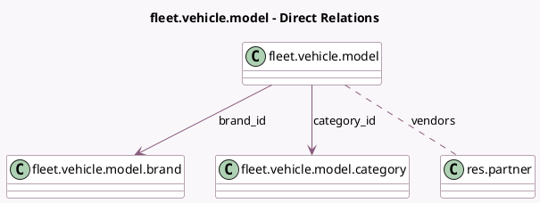

<!-- GENERATED:MODEL -->
---
tags: [odoo, community, generated, model]
---

# fleet.vehicle.model

- Module: [[docs/Community Addons/fleet/fleet|fleet]]
- Scope: Community Addons
- Defined in module: yes
- Source files: `models/fleet_vehicle_model.py`
- Python classes: `FleetVehicleModel`
- Description: Model of a vehicle
- Inherits: `avatar.mixin`, `mail.activity.mixin`, `mail.thread`

## Field footprint

- Detected fields: 27
- Field types: `Boolean` x 3, `Char` x 3, `Float` x 4, `Image` x 1, `Integer` x 4, `Many2many` x 1, `Many2one` x 2, `PropertiesDefinition` x 1, `Selection` x 8
- Relation fields: 3

## Sample fields

- `active`: `Boolean`
- `brand_id`: `Many2one` (comodel `fleet.vehicle.model.brand`)
- `category_id`: `Many2one` (comodel `fleet.vehicle.model.category`)
- `co2_emission_unit`: `Selection` (compute `_compute_co2_emission_unit`)
- `co2_standard`: `Char`
- `color`: `Char`
- `default_co2`: `Float` (comodel `CO₂ Emissions`)
- `default_fuel_type`: `Selection`
- `doors`: `Integer`
- `drive_type`: `Selection`
- `electric_assistance`: `Boolean`
- `horsepower`: `Float`
- `horsepower_tax`: `Float` (comodel `Horsepower Taxation`)
- `image_128`: `Image` (related `brand_id.image_128`)
- `model_year`: `Selection`
- `name`: `Char` (comodel `Model name`)
- `power`: `Float` (comodel `Power`)
- `power_unit`: `Selection`
- `range_unit`: `Selection`
- `seats`: `Integer`

## Method hints

- Detected methods: 7
- Action methods: `action_model_vehicle`
- Compute methods: `_compute_co2_emission_unit`, `_compute_display_name`, `_compute_vehicle_count`
- Onchange methods: none

## Direct relation diagram

## Navigation

- **Parent:** [[docs/Community Addons/fleet/Models]]

<!-- GENERATED:MODEL -->
