<!-- GENERATED:MODEL -->
---
tags: [odoo, community, generated, model]
---

# fleet.vehicle.odometer

- Module: [[docs/Community Addons/fleet/fleet|fleet]]
- Scope: Community Addons
- Defined in module: yes
- Source files: `models/fleet_vehicle_odometer.py`
- Python classes: `FleetVehicleOdometer`
- Description: Odometer log for a vehicle

## Field footprint

- Detected fields: 6
- Field types: `Char` x 1, `Date` x 1, `Float` x 1, `Many2one` x 2, `Selection` x 1
- Relation fields: 2

## Sample fields

- `date`: `Date`
- `driver_id`: `Many2one` (comodel `res.partner`, compute `_compute_driver_id`, store `True`)
- `name`: `Char` (compute `_compute_vehicle_log_name`, store `True`)
- `unit`: `Selection` (related `vehicle_id.odometer_unit`)
- `value`: `Float` (comodel `Odometer Value`)
- `vehicle_id`: `Many2one` (comodel `fleet.vehicle`)

## Method hints

- Detected methods: 3
- Action methods: none
- Compute methods: `_compute_driver_id`, `_compute_vehicle_log_name`
- Onchange methods: `_onchange_vehicle`

## Direct relation diagram

```plantuml
@startuml
!define ODOO_COLOR_PRIMARY #714B67
!define ODOO_COLOR_ACCENT #875A7B
!define ODOO_COLOR_BG #FAF7FA

skinparam backgroundColor ODOO_COLOR_BG
skinparam defaultTextAlignment left
skinparam ArrowColor ODOO_COLOR_ACCENT
skinparam ClassBackgroundColor white
skinparam ClassBorderColor ODOO_COLOR_PRIMARY
skinparam ComponentBackgroundColor white
skinparam ComponentBorderColor ODOO_COLOR_PRIMARY
skinparam NoteBackgroundColor #FFF8FF
skinparam NoteBorderColor ODOO_COLOR_ACCENT
skinparam SequenceLifeLineBorderColor ODOO_COLOR_ACCENT
skinparam SequenceLifeLineBackgroundColor #FFFFFF
skinparam SequenceParticipantBorderColor ODOO_COLOR_PRIMARY
skinparam SequenceParticipantBackgroundColor #FFFFFF
skinparam sequence {
  ArrowColor ODOO_COLOR_ACCENT
  ActorBorderColor ODOO_COLOR_PRIMARY
}
title fleet.vehicle.odometer - Direct Relations
class "fleet.vehicle.odometer" as fleet_vehicle_odometer
class "fleet.vehicle" as fleet_vehicle
class "res.partner" as res_partner
fleet_vehicle_odometer --> fleet_vehicle : vehicle_id
fleet_vehicle_odometer --> res_partner : driver_id
@enduml
```

## Navigation

- **Parent:** [[docs/Community Addons/fleet/Models]]

<!-- GENERATED:MODEL -->
