<!-- GENERATED:MODEL -->
---
tags: [odoo, community, generated, model]
---

# fleet.vehicle.odometer.report

- Module: [[docs/Community Addons/fleet/fleet|fleet]]
- Scope: Community Addons
- Defined in module: yes
- Source files: `report/odometer_report.py`
- Python classes: `OdometerReport`
- Description: Fleet Odometer Analysis Report

## Field footprint

- Detected fields: 7
- Field types: `Date` x 1, `Float` x 2, `Many2one` x 3, `Selection` x 1
- Relation fields: 3

## Sample fields

- `category_id`: `Many2one` (related `vehicle_id.category_id`)
- `fuel_type`: `Selection` (related `vehicle_id.fuel_type`)
- `mileage_delta`: `Float` (comodel `Mileage Delta`)
- `model_id`: `Many2one` (related `vehicle_id.model_id`)
- `odometer_value`: `Float` (comodel `Odometer Value`)
- `recorded_date`: `Date` (comodel `Date`)
- `vehicle_id`: `Many2one` (comodel `fleet.vehicle`)

## Method hints

- Detected methods: 1
- Action methods: none
- Compute methods: none
- Onchange methods: none

## Direct relation diagram

```plantuml
@startuml
!define ODOO_COLOR_PRIMARY #714B67
!define ODOO_COLOR_ACCENT #875A7B
!define ODOO_COLOR_BG #FAF7FA

skinparam backgroundColor ODOO_COLOR_BG
skinparam defaultTextAlignment left
skinparam ArrowColor ODOO_COLOR_ACCENT
skinparam ClassBackgroundColor white
skinparam ClassBorderColor ODOO_COLOR_PRIMARY
skinparam ComponentBackgroundColor white
skinparam ComponentBorderColor ODOO_COLOR_PRIMARY
skinparam NoteBackgroundColor #FFF8FF
skinparam NoteBorderColor ODOO_COLOR_ACCENT
skinparam SequenceLifeLineBorderColor ODOO_COLOR_ACCENT
skinparam SequenceLifeLineBackgroundColor #FFFFFF
skinparam SequenceParticipantBorderColor ODOO_COLOR_PRIMARY
skinparam SequenceParticipantBackgroundColor #FFFFFF
skinparam sequence {
  ArrowColor ODOO_COLOR_ACCENT
  ActorBorderColor ODOO_COLOR_PRIMARY
}
title fleet.vehicle.odometer.report - Direct Relations
class "fleet.vehicle.odometer.report" as fleet_vehicle_odometer_report
class "fleet.vehicle" as fleet_vehicle
fleet_vehicle_odometer_report --> fleet_vehicle : vehicle_id
@enduml
```

## Navigation

- **Parent:** [[docs/Community Addons/fleet/Models]]

<!-- GENERATED:MODEL -->
