<!-- GENERATED:MODEL -->
---
tags: [odoo, community, generated, model]
---

# fleet.vehicle.send.mail

- Module: [[docs/Community Addons/fleet/fleet|fleet]]
- Scope: Community Addons
- Defined in module: yes
- Source files: `wizard/fleet_vehicle_send_mail.py`
- Python classes: `FleetVehicleSendMail`
- Description: Send mails to Drivers
- Inherits: `mail.composer.mixin`

## Field footprint

- Detected fields: 4
- Field types: `Many2many` x 2, `Many2one` x 2
- Relation fields: 4

## Sample fields

- `attachment_ids`: `Many2many` (comodel `ir.attachment`)
- `author_id`: `Many2one` (comodel `res.partner`)
- `template_id`: `Many2one`
- `vehicle_ids`: `Many2many` (comodel `fleet.vehicle`)

## Method hints

- Detected methods: 4
- Action methods: `action_save_as_template`, `action_send`
- Compute methods: `_compute_render_model`
- Onchange methods: `_onchange_template_id`

## Direct relation diagram

```plantuml
@startuml
!define ODOO_COLOR_PRIMARY #714B67
!define ODOO_COLOR_ACCENT #875A7B
!define ODOO_COLOR_BG #FAF7FA

skinparam backgroundColor ODOO_COLOR_BG
skinparam defaultTextAlignment left
skinparam ArrowColor ODOO_COLOR_ACCENT
skinparam ClassBackgroundColor white
skinparam ClassBorderColor ODOO_COLOR_PRIMARY
skinparam ComponentBackgroundColor white
skinparam ComponentBorderColor ODOO_COLOR_PRIMARY
skinparam NoteBackgroundColor #FFF8FF
skinparam NoteBorderColor ODOO_COLOR_ACCENT
skinparam SequenceLifeLineBorderColor ODOO_COLOR_ACCENT
skinparam SequenceLifeLineBackgroundColor #FFFFFF
skinparam SequenceParticipantBorderColor ODOO_COLOR_PRIMARY
skinparam SequenceParticipantBackgroundColor #FFFFFF
skinparam sequence {
  ArrowColor ODOO_COLOR_ACCENT
  ActorBorderColor ODOO_COLOR_PRIMARY
}
title fleet.vehicle.send.mail - Direct Relations
class "fleet.vehicle.send.mail" as fleet_vehicle_send_mail
class "fleet.vehicle" as fleet_vehicle
class "ir.attachment" as ir_attachment
class "res.partner" as res_partner
fleet_vehicle_send_mail .. fleet_vehicle : vehicle_ids
fleet_vehicle_send_mail --> res_partner : author_id
fleet_vehicle_send_mail .. ir_attachment : attachment_ids
@enduml
```

## Navigation

- **Parent:** [[docs/Community Addons/fleet/Models]]

<!-- GENERATED:MODEL -->
