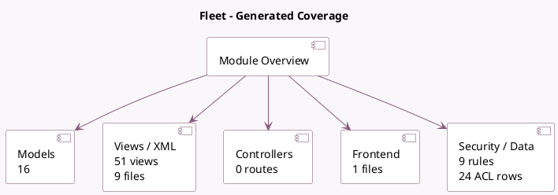

<!-- GENERATED:MODULE -->
---
tags: [odoo, community, module]
---

# Fleet

- Scope: Community Addons
- Source: odoo/addons/fleet
- Dependencies: base (not documented), [[docs/Community Addons/mail/mail|mail]]

## Summary

Manage your fleet and track car costs

## Generated coverage

- Models: 16
- XML files with UI/data artifacts: 9
- Views: 51
- Actions: 15
- Menus: 21
- Rules (ir.rule): 9
- Access CSV entries: 24
- Controller units: 0
- Frontend asset files: 1

## Module map

## Detail notes

- Models: [[docs/Community Addons/fleet/Models|Models]] (16)
- Views and XML: [[docs/Community Addons/fleet/Views|Views]] (9 files)
- Frontend: [[docs/Community Addons/fleet/Frontend|Frontend]] (1 files)

## Key models

- `fleet.service.type`
- `fleet.vehicle`
- `fleet.vehicle.assignation.log`
- `fleet.vehicle.cost.report`
- `fleet.vehicle.log.contract`
- `fleet.vehicle.log.services`
- `fleet.vehicle.model`
- `fleet.vehicle.model.brand`
- `fleet.vehicle.model.category`
- `fleet.vehicle.odometer`
- `fleet.vehicle.odometer.report`
- `fleet.vehicle.send.mail`

## Navigation

- [[../Community Addons/Community Addons|Back to scope]]
- [[../../docs/docs|Back to docs]]

<!-- GENERATED:MODULE -->

