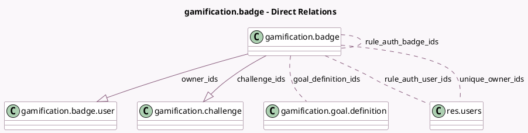

<!-- GENERATED:MODEL -->
---
tags: [odoo, community, generated, model]
---

# gamification.badge

- Module: [[docs/Community Addons/gamification/gamification|gamification]]
- Scope: Community Addons
- Defined in module: yes
- Source files: `models/gamification_badge.py`
- Python classes: `GamificationBadge`
- Description: Gamification Badge
- Inherits: `image.mixin`, `mail.thread`

## Field footprint

- Detected fields: 20
- Field types: `Boolean` x 2, `Char` x 1, `Html` x 1, `Integer` x 8, `Many2many` x 4, `One2many` x 2, `Selection` x 2
- Relation fields: 6

## Sample fields

- `active`: `Boolean` (comodel `Active`)
- `challenge_ids`: `One2many` (comodel `gamification.challenge`)
- `description`: `Html` (comodel `Description`)
- `goal_definition_ids`: `Many2many` (comodel `gamification.goal.definition`)
- `granted_count`: `Integer` (comodel `Total`, compute `_get_owners_info`)
- `granted_users_count`: `Integer` (comodel `Number of users`, compute `_get_owners_info`)
- `level`: `Selection`
- `name`: `Char` (comodel `Badge`)
- `owner_ids`: `One2many` (comodel `gamification.badge.user`)
- `remaining_sending`: `Integer` (comodel `Remaining Sending Allowed`, compute `_remaining_sending_calc`)
- `rule_auth`: `Selection`
- `rule_auth_badge_ids`: `Many2many` (comodel `gamification.badge`)
- `rule_auth_user_ids`: `Many2many` (comodel `res.users`)
- `rule_max`: `Boolean` (comodel `Monthly Limited Sending`)
- `rule_max_number`: `Integer` (comodel `Limitation Number`)
- `stat_my`: `Integer` (comodel `My Total`, compute `_get_badge_user_stats`)
- `stat_my_monthly_sending`: `Integer` (comodel `My Monthly Sending Total`, compute `_get_badge_user_stats`)
- `stat_my_this_month`: `Integer` (comodel `My Monthly Total`, compute `_get_badge_user_stats`)
- `stat_this_month`: `Integer` (comodel `Monthly total`, compute `_get_badge_user_stats`)
- `unique_owner_ids`: `Many2many` (comodel `res.users`, compute `_get_owners_info`)

## Method hints

- Detected methods: 5
- Action methods: none
- Compute methods: none
- Onchange methods: none

## Direct relation diagram

## Navigation

- **Parent:** [[docs/Community Addons/gamification/Models]]

<!-- GENERATED:MODEL -->
