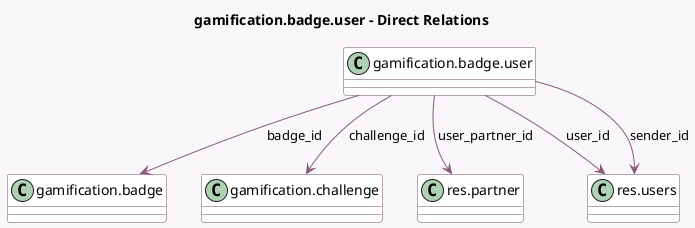

<!-- GENERATED:MODEL -->
---
tags: [odoo, community, generated, model]
---

# gamification.badge.user

- Module: [[docs/Community Addons/gamification/gamification|gamification]]
- Scope: Community Addons
- Defined in module: yes
- Source files: `models/gamification_badge_user.py`
- Python classes: `GamificationBadgeUser`
- Description: Gamification User Badge
- Inherits: `mail.thread`

## Field footprint

- Detected fields: 8
- Field types: `Char` x 1, `Many2one` x 5, `Selection` x 1, `Text` x 1
- Relation fields: 5

## Sample fields

- `badge_id`: `Many2one` (comodel `gamification.badge`)
- `badge_name`: `Char` (related `badge_id.name`)
- `challenge_id`: `Many2one` (comodel `gamification.challenge`)
- `comment`: `Text` (comodel `Comment`)
- `level`: `Selection` (related `badge_id.level`, store `True`)
- `sender_id`: `Many2one` (comodel `res.users`)
- `user_id`: `Many2one` (comodel `res.users`)
- `user_partner_id`: `Many2one` (comodel `res.partner`, related `user_id.partner_id`)

## Method hints

- Detected methods: 4
- Action methods: none
- Compute methods: none
- Onchange methods: none

## Direct relation diagram

## Navigation

- **Parent:** [[docs/Community Addons/gamification/Models]]

<!-- GENERATED:MODEL -->
